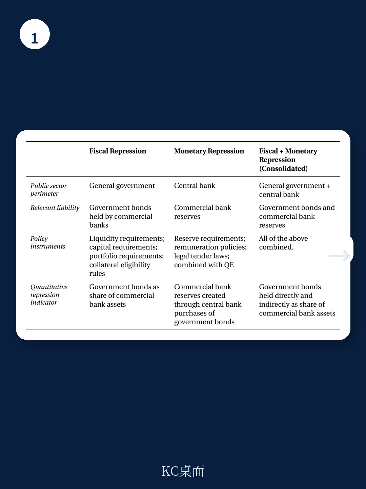
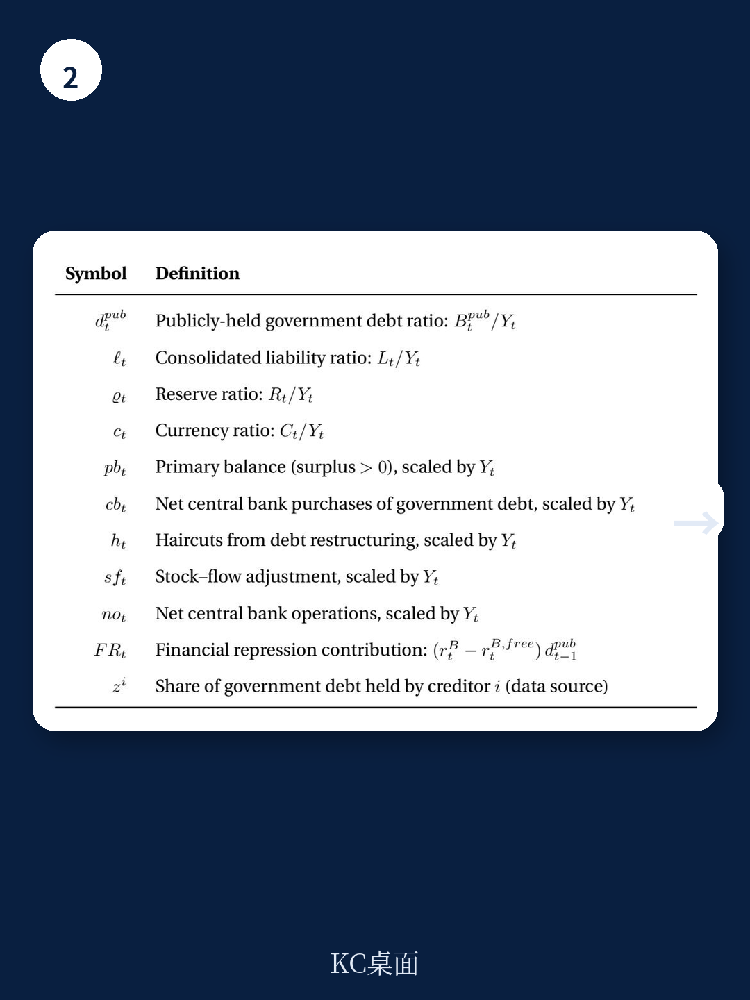

# IMF：资金结构与相关数据观察

公共债务处于和平时期高位，传统财政整顿与增长改革推进缓慢，发达地区是否可能重新转向资金压抑来减轻债务负担？IMF在2026年7月发布的工作论文中，用17个发达地区自1920年以来的数据给出了一个值得认真对待的回答：资金压抑并非历史遗物，它在二战后达到顶峰，在资本账户自由化时期消退，2008年全球资金扰动后又重新上升。

这份报告的核心贡献在于测量。作者没有沿用利率对比的老路，而是从资产组合选择模型出发，利用银行与家庭持有政府债务的差异来识别压抑强度。银行受监管约束，在同等回报表现下愿意持有更多公共负债；家庭没有这类不确定性，其组合行为可作为市场基准。两者之间的缺口，就是资金压抑的刻度。

## 1. 两项数量指标区分财政压抑与货币压抑

报告提出两个互补指标。窄口径的财政指标捕捉银行被要求持有政府债券的不确定性；合并口径则把中央银行负债纳入考量，覆盖通过准备金要求实施的压抑。这一区分并非技术细节，它对应两种不同的政策工具：前者直接压低主权借款成本，后者通过低息持有央行负债形成隐性转移。

样本覆盖17个发达地区，时间跨度超过一个世纪。二战前后是压抑的高峰期，布雷顿森林体系时期维持高位，1971年后逐步消退，全球资金扰动后再度回升。报告还验证了指标与法定工具的对应关系：准备金要求和组合研究要求越严格，指标读数越高。这说明数量指标捕捉的确实是政策环境，而非偶然的市场现象。

> **KC评论：** 过去讨论资金压抑，多依赖利率对比或单一国家案例，难以跨时空比较。这套数量指标的价值在于，它把“银行被迫多买了多少国债”变成了可系统比较的刻度，让百年历史有了统一的度量单位。

## 2. 压抑与高债务、低利率及私人部门挤出同时出现

报告检验了资金压抑与一系列宏观条件的关系。结果显示，压抑最盛行的时期，往往也是政府债务和利息支出较高的时期，同时伴随较高的初级财政盈余——这符合直觉：当传统财政工具空间收窄时，政府更可能转向压抑渠道。

压抑还与低短期和长期利率、政府债券回报表现相对私人资产回报偏低同时出现。更值得注意的是，它伴随私人信贷增长节奏变化、贷存比下降和研究减少。这些相关性指向同一个机制：压抑把资金从私人部门挤向公共部门，代价是私人资本形成的调整。报告还发现，压抑指标与资本管制程度正相关，说明跨境资本流动受限是压抑得以实施的条件之一。

## 3. 二战后英国去杠杆的第一大渠道是资金压抑

报告将压抑指标嵌入债务分解框架，量化其对债务动态的贡献。方法上，作者先求解不存在压抑时债券市场的出清利率，再把这个反事实利率与实际利率之差纳入统一的债务分解，与初级盈余、利率增长差、通胀冲击、央行购债和债务重组并列比较。

结果相当有分量。在英国，资金压抑是战后十年最大的去杠杆渠道，贡献超过通胀冲击和财政整顿。在美国，财政整顿贡献最大，但资金压抑也是主要力量。全样本中位数显示，资金压抑带来的年度财政节省约为GDP的0.57%，1940年代中期达到峰值。各国差异在1940年代和1950年代初尤为显著，1980年代再次扩大。全球资金扰动后，中位数财政节省从2008年的约0.08%升至2020年的约0.51%。

## 4. 当前条件与压抑高发期的历史特征存在重叠

报告最后把目光投向当下。作者指出，与历史上资金压抑高发期相关的条件——高债务负担、受限的资本流动、低利率环境——在当前许多发达地区中同时存在。基于这一观察，报告认为资金压抑的使用可能继续增加。

这一判断并非预测，而是基于历史规律的推断。报告没有断言压抑必然回归，而是指出条件已经具备。对于观察者而言，值得跟踪的指标包括：银行持有政府债券的比例是否持续偏离家庭部门的配置、准备金要求是否变化、以及政府债券回报表现与私人资产回报之间的缺口是否扩大。这些数量信号比政策表态更能说明问题。

> **KC评论：** 报告最有用的部分是把“资金压抑”从一个模糊概念变成了可观察的指标。读者不需要等到政策文件明确提及压抑，只需盯住银行与家庭持有政府债务的缺口变化，就能提前识别压抑是否在累积。

报告的局限在于，反事实利率的构建依赖模型假设，不同设定下财政节省的估计会有差异。但作为系统测量资金压抑的首次尝试，这份研究提供了一个可复用的分析框架，也为理解当前高债务环境下的政策选择提供了历史参照。
