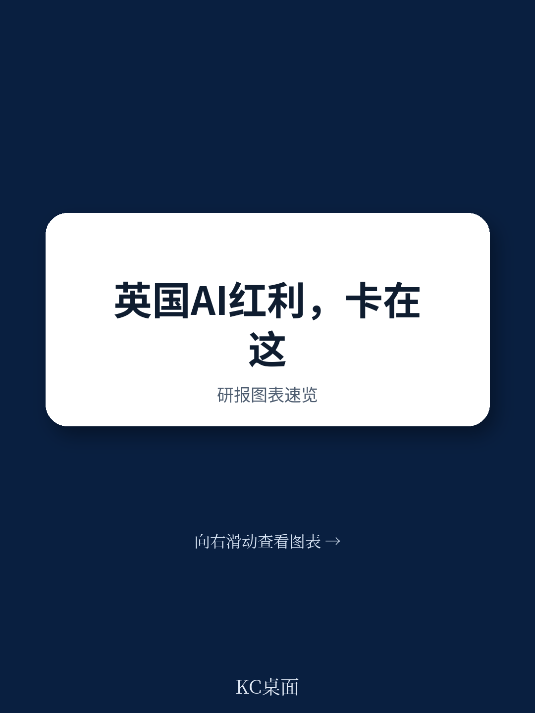
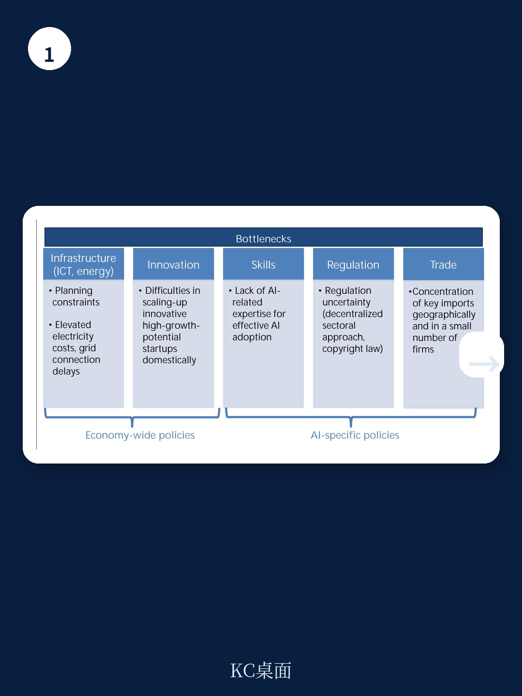
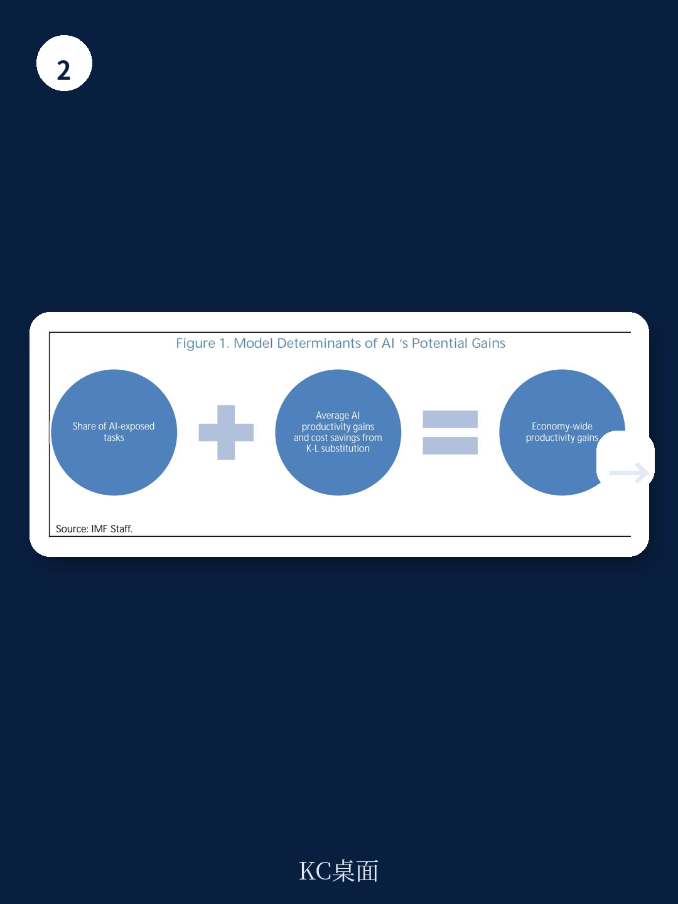

# IMF：AI与组织管理与生产率技术应用观察

英国过去二十年的生产率增速明显节奏变化，全要素生产率增长仍在调整是主因。IMF在2026年7月发布的国别报告中提出一个判断：AI技术为英国提供了一个显著的机会窗口，而英国在发达地区中的位置并不差——关键在于五个使能条件能否到位。

这份题为《Unlocking AI-Led Productivity Growth in the United Kingdom》的IMF选编论文（SIP/2026/072）由欧洲部团队撰写，完成于2026年6月24日。报告的核心发现是：英国劳动力中近三分之二从事AI可暴露职业，且超过一半属于高互补性岗位——AI在这些岗位上提升现有工人的生产率，而非直接替代。加上英国在商业服务、资金、IT、制药等知识密集型行业的集中度，其从AI中获取收益的潜力高于欧洲平均水平，与美国的估计相当。

但潜力不等于现实。报告识别出五个瓶颈：ICT与能源基础设施建设、创新融资、监管框架、技能供给、贸易开放度。其中监管不确定性和AI相关技能短缺被列为最紧迫的约束。作者用内生技术采用模型校准英国宏观环境后发现，若将监管约束减半并扩大AI技能供给，AI带来的产出增益可较基准情景提高三分之二。

## 1. 英国劳动力结构与产业特征构成AI收益的有利条件

报告引用Misch等（2025）的估计，英国中期TFP年增益在0.1至0.5个百分点之间，高于欧洲国家平均水平，与美国相当。这一优势的来源有两个。

其一是劳动力结构。约36%的英国劳动力持有大学学位，近三分之二从事AI可暴露职业。更关键的是，这些暴露岗位中超过一半属于高互补性职业——专业人员和经理等角色，AI增强其工作而非取代。这意味着英国面临的AI相关就业错配不确定性相对有限。

其二是产业构成。AI生产率增益最大的职业集中在商业服务、资金、IT和制药，而这些恰好是英国的优势部门。这些职业以认知性、知识密集性和分析性任务为主，正是当前生成式AI和大语言模型表现最好的领域。此外，英国劳动力成本高于OECD平均水平，企业用AI替代部分劳动投入的动机更强。

> **KC评论：** 报告对“AI暴露”做了区分——高暴露高互补与高暴露低互补是两回事。英国的优势在于前者占比高，这决定了AI对英国就业市场更多是增强而非替代。看其他国家的AI潜力时，这个区分比单纯的“暴露比例”更有信息量。

## 2. 五项使能条件中监管与技能构成最紧约束

报告用五个维度评估英国的AI准备度，每一维度都有具体瓶颈。

基础设施方面，数据中心建设面临规划审批周期长和电网接入排队的问题。报告引用独立评估指出，英国ICT基础设施在发达地区中排名靠前，但能源基础设施和电价竞争力构成制约。融资方面，英国初创企业数量不少，但规模化融资（scale-up financing）渠道有限，高增长潜力的AI企业难以获得与硅谷相当的后期资金支持。

监管是报告着墨较多的领域。企业调查显示，监管框架的不确定性是影响AI采用决策的重要因素。英国目前缺乏统一的AI监管立法，各部门规则分散，企业难以判断合规边界。技能方面，AI相关岗位的招聘难度在上升，数据科学家、机器学习工程师等职位供给不足。贸易开放度方面，报告认为英国对前沿AI输入（芯片、模型）的获取依赖外部供应链，地缘碎片化不确定性可能在未来制约AI扩散。

值得注意的一个背景是：截至2025年中，英国企业AI采用率为34%，接近欧盟平均的37%和美国36%。采用率并不落后，但报告认为“采用”不等于“有效采用”——后者取决于上述使能条件是否到位。

## 3. 模型模拟显示监管改革与技能扩张的联合效应最大

报告的核心定量贡献来自一个内生技术采用模型。作者校准了英国宏观环境参数，模拟三类政策干预的生产率影响：监管改革、技能研究、供应链韧性建设。

基准情景下，AI对英国全要素生产率的增益在中期逐步显现。若将监管约束减半，产出增益较基准提高约四分之一。若扩大AI相关技能供给，增益提高约三分之一。两项政策同时实施，联合效应可使产出增益提高三分之二——这超过了各自效果的简单加总，说明监管与技能之间存在互补关系：监管放松让企业有动力采用AI，而技能供给确保企业有能力有效采用。

报告还模拟了外部模型访问中断的情景。结果显示，即使中等程度的供应中断也可能造成可观的产出损失。作者据此提出，研究于本土AI生态（包括基础模型能力和算力基础设施）具有保险价值——这不是为了追求最优效率，而是为了降低尾部不确定性。

> **KC评论：** 联合效应大于单项加总，这是模型模拟中最值得注意的结果。它说明监管和技能不是两个独立政策选项，而是互为条件的组合。对政策制定者而言，这意味着单边推进某一项改革的效果可能有限，需要同步设计。

## 4. 报告对英国AI战略的评估与政策优先级建议

报告认为，英国政府现有的AI战略覆盖了正确的领域，但优先级需要调整。宏观环境范围内的改革——规划审批、能源市场、规模化融资——是AI发展和采用的基础前提，报告对此予以肯定。但仅靠这些还不够，需要更精准的AI专项干预。

报告建议将监管框架的明确化放在更优先的位置。当前的不确定性不仅影响企业研究决策，也影响AI在受监管行业（资金、医疗、法律）的落地速度。技能供给方面，报告建议扩大AI相关教育和培训的规模，同时关注在职人员的技能转换。

关于贸易开放度，报告的态度较为审慎。它承认开放贸易对获取前沿输入和扩大出口市场都有利，但也指出供应链韧性需要单独考虑。本土AI能力建设不是贸易替代，而是对冲。

报告还从ICT革命的历史中提取了一个教训：生产率增益主要来自AI使用部门而非AI生产部门，且扩散需要时间。这意味着政策评估不能只看AI产业的规模，更要看传统行业采用AI的深度和速度。

---

这份报告的价值不在于给出一个精确的产出增益数字——模型模拟本身依赖大量假设，不同研究的TFP增益估计从低于1%到35%不等，区间极宽。它的价值在于提供了一个可操作的诊断框架：五个使能条件、每个条件的具体瓶颈、政策干预的相对优先级。对关注英国AI进程的观察者来说，值得跟踪的指标不是AI采用率本身，而是监管框架的明确化进度和AI相关技能供给的变化——这两项是模型识别出的最紧约束。

For informational purposes only. Portions may be generated,translated,summarized,or edited with AI assistance based on source materials and may contain omissions or errors. Please verify independently. This is not investment,legal,tax,accounting,or other professional advice.

