# Why Have UK Gilt Yields Moved Ahead of G7 Peers?

Benjamin Mosk

SIP/2026/073

IMF Selected Issues Papers are prepared by IMF staff as background documentation for periodic consultations with member countries. It is based on the information available at the time it was completed on June 24, 2026. This paper is also published separately as IMF Country Report No 26/173.

2026
JUL

# IMF Selected Issues Paper European Department

# Why Have UK Gilt Yields Moved Ahead of G7 Peers? Prepared by Benjamin Mosk

Authorized for distribution by Romain Alexandre Duval
July 2026

IMF Selected Issues Papers are prepared by IMF staff as background documentation for periodic consultations with member countries. It is based on the information available at the time it was completed on June 24, 2026. This paper is also published separately as IMF Country Report No 26/073.

ABSTRACT: Since 2022, UK gilt yields, especially at long maturities, have risen above G7 peers, increasing borrowing costs and tightening financial conditions. This paper examines the drivers of the UK term premium—the component of yields reflecting time-varying risk compensation beyond expected short rates. In the UK, shifts in the investor base and rising importance of domestic factors may also have contributed, alongside signs of increased market fragility after the September 2022 turmoil. Maintaining credible policy frameworks and adapting debt management strategies to evolving demand conditions are key to containing the term premium.

RECOMMENDED CITATION: Mosk, Benjamin. "Why Have UK Gilt Yields Moved Ahead of G7 Peers?" IMF Selected Issues Paper 26/073.

JEL Classification Numbers:

G12, G15, E43, H63

Keywords:

Term Premium; United Kingdom

Author's E-Mail Address:

bmosk@imf.org

SELECTED ISSUES PAPERS

# Why Have UK Gilt Yields Moved Ahead of G7 Peers?

United Kingdom

Prepared by Benjamin Mosk $^{1}$

# UNITED KINGDOM

SELECTED ISSUES

July 2026

## Approved By

Prepared By Benjamin Mosk (MCM)

European Department

## CONTENTS

WHY HAVE UK GILT YIELDS MOVED AHEAD OF G7 PEERS?\_\_\_\_3
A. Introduction \_\_\_\_3
B. Gilt Market Structure and Long-Term Trends \_\_\_\_7
C. Analysis of Term Premium Drivers and Dynamics \_\_\_\_12
D. Discussion and Recommendations\_\_\_\_23

## FIGURES

1. G7 Long-Term Yields \_\_\_\_ 4
2. UK Term Premium Decomposition \_\_\_\_ 5
3. UK & G7 Yield Changes Since 2022 \_\_\_\_ 6
4. Sovereign Debt Structure \_\_\_\_ 8
5. Maturity Distribution and Pension Fund Size \_\_\_\_ 8
6. Gilt Holdings \_\_\_\_ 9
7. Term Premium and Investor Base \_\_\_\_ 10
8. Sovereign Bond Market Size \_\_\_\_ 11
9. Government Debt \_\_\_\_ 11
10. Credit Ratings \_\_\_\_ 12
11. Economic Policy Uncertainty \_\_\_\_ 12
12. Factor Analysis of Yield Dynamics \_\_\_\_ 15
13. Term Premium Shock Decomposition \_\_\_\_ 17
14. G7 Panel Regression Coefficients \_\_\_\_ 19
15. UK Term Premium Sensitivity to Economic Policy Uncertainty \_\_\_\_ 20
16. Gilt Yield Volatility \_\_\_\_ 21

## TABLE

1. Overview of Empirical Approaches \_\_\_\_ 13

2. BVAR Sign Restrictions \_\_\_\_ 16

3. G7 Panel Regression \_\_\_\_ 18

4. UK Term Premium Regression 19  
5. Volatility Regression 20  
6. Summary of Findings 22  
ANNEX  
I. Supplementary Data and Empirical Results 25  
References 30

# WHY HAVE UK GILT YIELDS MOVED AHEAD OF G7 PEERS?

Since 2022, UK gilt yields—particularly at long maturities—have risen and moved above G7 peers. Elevated long-term yields increase sovereign borrowing costs and can transmit to financial conditions more broadly, with implications for fiscal sustainability and financial stability. This paper presents stylized facts and a range of complementary empirical analyses to identify the contribution of the UK term premium to higher yields, assess its drivers and derive policy-relevant insights.

The level of UK yields reflects both elevated expected short rates and the term premium. This paper focuses on the latter, which captures the time-varying risk compensation not explained by the expected path of short rates. Empirical evidence points to a coherent set of drivers behind the rise in the UK term premium across two dimensions: (1) a gradual long-term structural change in demand-supply conditions in the gilt market; and (2) a regime shift following the September 2022 gilt market turmoil, after which domestic risk factors have played a larger role and gilt markets have become more prone to volatility spikes.

Against this backdrop, policy should focus on three areas: managing the quantity and composition of bond supply, reinforcing policy credibility, and strengthening market resilience.

## A. Introduction

1. While gilt yields had declined and remained broadly in the middle of the G7 range for much of the 2010s, they have risen and moved ahead of G7 peers in the past few years. This divergence is particularly pronounced at the long end of the curve, with 30-year gilt yield increasing more sharply relative to other G7 sovereigns (see Figure 1). $^{1}$ This shift began in 2022, coinciding with the gilt market turmoil following the September 2022 “mini budget” announcement, marking a clear break from previous dynamics.

Figure 1. G7 Long-Term Yields  
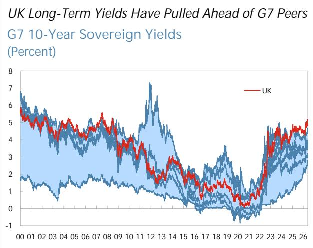

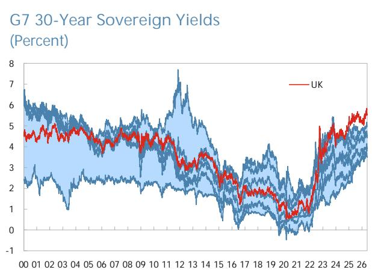  
Sources: Refinitiv Datastream, and IMF staff calculations. Blue area indicates range of yields of G7 peers.

2. Over the past two years, increases in the UK term premium have more than offset declines in expected short rates, bringing long-term yields to their highest level since 2008. $^{2}$ Sovereign borrowing costs can move for different reasons. At longer maturities, yields can generally be decomposed into the expected path of future short-term interest rates and a term premium compensating investors for risk. In advanced economies, short rates are largely determined by the central bank's policy rate, which is set to achieve price stability. In the UK—similar to other economies—policy rates were raised sharply during the post-pandemic period of elevated inflation, driven by supply chain disruptions and pent-up demand, and further amplified by the energy price shock following Russia's invasion of Ukraine. While expected short rates have declined gradually since mid-2023, the UK term premium has increased, preventing longer-term yields from falling accordingly (see Figure 2). Decompositions based on the Bank of England's (BoE) term structure models similarly attribute 2025 movements in UK long-term yields primarily to changes in the (real) term premium (Panigrahi and Sidhu, 2026). These observations raise the question of what has driven long-term UK gilt yields—and the term premium in particular—to rise ahead of G7 peers, and what could be done to reverse this trend.

Figure 2. Term Premium Decomposition  
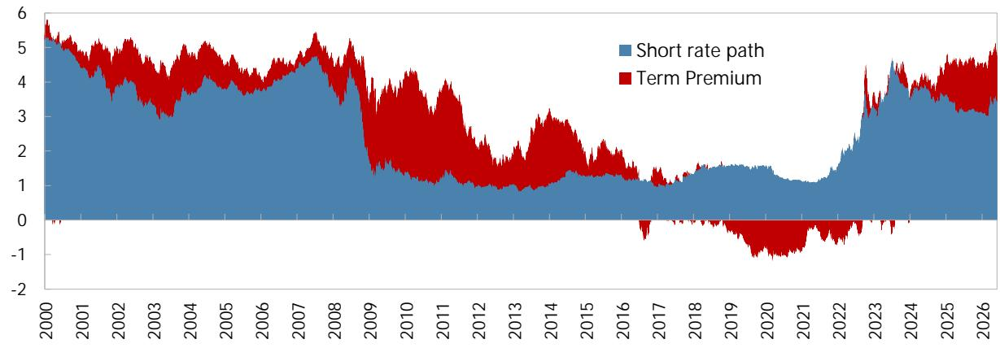  
Source: Bloomberg, IMF staff calculations. Latest data: 5/31/2026.

3. The expected path of short rates and the term premium are influenced by different policy channels. The expected path of short rates reflects monetary policy decisions in response to macroeconomic conditions, including exogenous shocks to inflation and growth, but is also shaped—albeit indirectly—by fiscal policy and underlying macroeconomic features of the economy. By contrast, the term premium captures risk compensation, uncertainty, and bond market structure factors, such as changes in the investor base. As a result, while short-rate expectations adjust in part to broader economic conditions, credible and predictable policies—particularly in fiscal policy, debt management, and efforts to enhance market functioning—can help contain the term premium by reducing uncertainty and improving the market's capacity to absorb shocks.

4. This paper focuses on the term premium, which can vary independently of monetary policy expectations and has been a key driver of higher long-term yields in recent years. Over 2022–26, both expected short rates and the term premium have contributed to increases in long-term gilt yields (see Figure 3). In March 2026, UK CPI inflation was highest among G7 peers—and had been on the higher end of the range since the mid of 2023 (Annex Figure 17). Commensurately, the UK policy rate was also on the upper end of the G7-range in recent years (Annex Figure 18). However, looking at the mid-2023 to early-2026 period, expected short rates declined (Figure 2), and an increase in the term premium (see Figures 2 and 3) was the primary force behind the rise in long-term yields to their highest levels since 2008. Most recently, the contribution of expected short-term rates to long-term yields jumped at the start of the 2026 conflict in the Middle East, as markets repriced for higher inflation expectations in response to the energy price shock—this illustrates how the short rate component reacts to exogenous shocks.

Sources: Bloomberg, and IMF staff calculations.
Note: Yield and component changes since 1/1/2022 until 5/31/2026.

Figure 3. UK & G7 Yield Changes Since 2022  
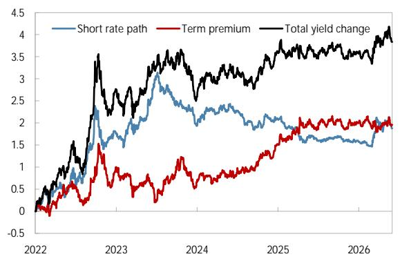

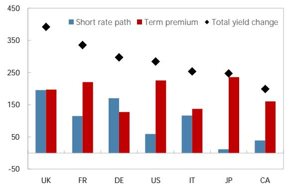

5. Term premia are shaped by a combination of financial, macroeconomic, policy, and structural supply-demand factors. A substantial body of literature examines the determinants of sovereign bond term premia. Foundational work focuses on the measurement of term premia using no-arbitrage term structure models, notably Kim and Wright (2005) and Adrian, Crump, and Moench (2013), which provide widely used decompositions of long-term yields into expected short rates and risk compensation. Building on these measures, the return-predictability literature demonstrates that term premia are time-varying and predictable using financial indicators such as forward rates (Cochrane and Piazzesi, 2005). Another important strand emphasizes the role of supply and demand factors within preferred-habitat or market segmentation frameworks. Vayanos and Vila (2009, published 2021) provide the theoretical foundation, while Greenwood and Vayanos (2014) show empirically that government bond supply of and investor demand for duration influence term premia. The impact of monetary policy and central bank balance sheets has also been extensively studied; Krishnamurthy and Vissing-Jorgensen (2011) and Hanson and Stein (2015) document how large-scale asset purchases affect long-term yields through duration removal and portfolio balance channels. Finally, a growing literature highlights the importance of global risk and policy uncertainty. Miranda-Agrippino and Rey (2020) emphasize the role of the global financial cycle, while Leippold and Mueller (2022) show that economic policy uncertainty can significantly affect the yield curve and term premia. Together, these strands underscore that term premia are shaped by a combination of financial, macroeconomic, policy, and structural supply-demand factors. The foundational literature is largely based on US data; UK-focused work is limited. For example, Kaminska and Mumtaz (2022) show that QE affects gilt yields through multiple channels—including signaling, policy uncertainty, and bond-supply effects—with the latter two operating through term premia. Stehn (2025) assesses drivers of the UK term premium and finds a positive relationship with unemployment, debt, inflation uncertainty and foreign term premia. Kadiric (2022) shows that the Brexit referendum materially affected sovereign risk premia (although not directly assessing the impact on the term premium).

Lengyel (2026) finds that higher-than-expected sovereign debt issuance raises yields by increasing both real term premia and inflation risk premia, with these effects becoming more pronounced during periods of market stress. This note adds a cross-country perspective combined with UK-focused analysis.

6. This Selected Issues Paper is structured as follows. Section B presents key stylized facts on the evolution of UK gilt yields in a G7 context, focusing on relevant long-term trends. Section C addresses the puzzle of why UK gilt yields have risen above G7 peers by combining multiple complementary empirical approaches, with a focus on the term premium and its drivers. Section D discusses policy implications.

## B. Gilt Market Structure and Long-Term Trends

7. This section provides structural context for recent term premium dynamics by examining key features of the UK gilt market. It presents stylized facts on the investor base, market liquidity, and sovereign credit profile, with a focus on long-term trends and cross-country comparisons. These structural characteristics are difficult to capture in empirical models but are essential for interpreting recent developments in gilt yields and term premia.

## Gilt Market's Investor Base

8. The UK's debt structure has historically reflected investors' strong demand for long-term bonds, which helped to contain the term premium despite a long average maturity. The UK debt's weighted average maturity is just under 14 years, compared to 6 to 9 years for other G7 countries (see Figure 4). This reflects the Debt Management Office's long-standing strategy of issuing a large share of long-dated bonds, alongside a relatively high proportion of inflation-linked securities and a limited reliance on short-term bills. A key factor underpinning this strategy has been strong demand from the UK's sizable defined benefit pension fund sector, which has a natural preference for long-term bonds and inflation-linked assets to match its liabilities (see Figure 5). $^{3}$ This stable demand at the long end of the curve has enabled the DMO to maintain a high average maturity, thereby reducing rollover risk at relatively modest cost.

The UK stands out with its high average maturity and large share of inflation linked bonds

Figure 4. Sovereign Debt Structure

Sovereign Debt Weighted Average Maturity (Years)

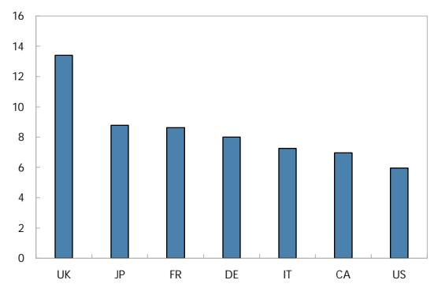  
Source: Bloomberg, IMF staff calculations. Reference date: 2/12/2026.

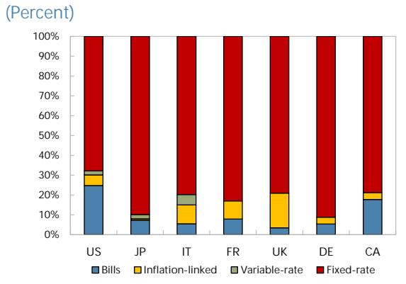

## Figure 5. Maturity Distribution and Pension Fund Size

Amongst G7 countries, the UK has the largest share of bonds with maturity >30 years. The UK has a large defined benefit pension fund sector, with long-term interest rate exposures on the liability side.

G7 Sovereign Debt Maturity Distribution (Percent)

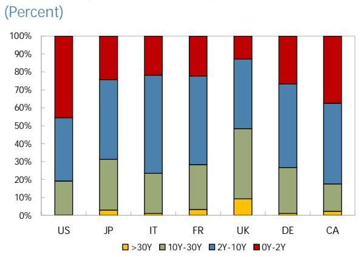  
Sources Bloomberg, and IMF staff calculations. Reference date: 2/12/2026.  
Pension Fund Assets as Percentage of GDP (Percent)

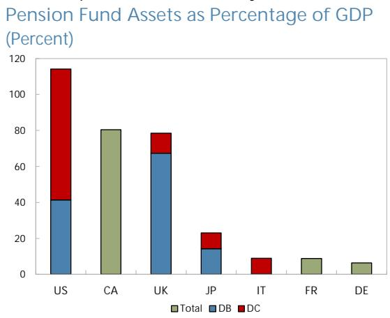  
Source: OECD. DB = defined benefit. DC=defined contribution. Note: breakdown between DB and DC is not available for all countries. 2024.

9. However, gilt demand is shifting, with weaker domestic institutional demand and greater foreign participation, resulting in a less stable investor base. UK pension funds are increasingly shifting from defined benefit to defined contribution schemes, and their holdings of gilts have declined both in absolute and relative terms. While insurance corporations and pension funds have reduced their share of gilt holdings over the past two decades, the BoE partly offset this by becoming a significant and stable holder through its asset purchase programs (Figure 6). With quantitative tightening now ongoing, however, the Bank is reducing its holdings. At the same time, foreign participation in the gilt market has increased, potentially bringing a larger share of more price-sensitive “fast money” investors and exposing the market to more volatile capital flows. The

trend of declining pension fund gilt holdings is expected to continue (Office for Budget Responsibility, 2025), in part due to a volume effect, but also due to the shift from defined benefit schemes to defined contribution schemes (see Annex Figure 21). The Office for Budget Responsibility estimates that the decline in the pensions sector's gilt holdings could push up interest rates on government debt by around 0.8 percentage points, assuming the stock of debt remains close to 100 per cent of GDP (Office for Budget Responsibility, 2025).

## Figure 6. Gilt Holdings

The share of gilts held by the insurance corporation and pension fund sector has declined, while foreign holdings have increased.

UK Gilt Market Holding Structure by Sector (Percent)

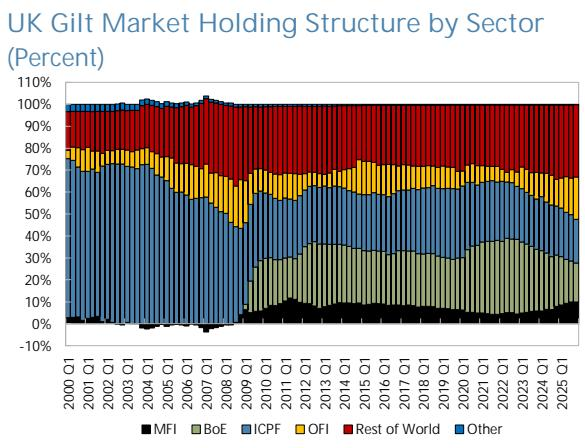  
Defined Benefit Pension Scheme Gilt Holdings (GBP billion)

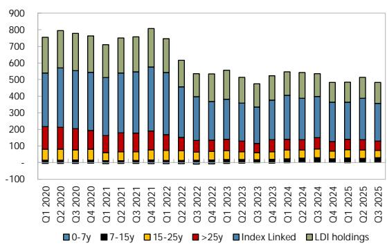  
Sources: HM Treasury, Office for National Statistics, and IMF staff calculations. MFI = monetary financial institutions. ICPF = insurance corporations and pension funds. OFI = other financial institutions. Sectoral holdings in the UK financial accounts are subject to limitations related to data granularity, coverage gaps, and the constraints of traditional survey-based methodologies.  
Sources: Office for National Statistics, and IMF staff calculations. LDI = liability-driven investment.

10. The shift in the investor base may have contributed to a higher term premium. A commonly cited explanation for the increase in long-term yields is a decline in structural demand for gilts, particularly at longer maturities. Empirically, however, the strength of this relationship is subject to uncertainty, as the relevant variables are slow-moving and observed at low frequency, making it challenging to distinguish genuine relationships from coinciding trends. To provide a high-level perspective, an index is constructed that captures the share of foreign holdings relative to more stable holders—namely the central bank, insurance corporations, and pension funds (see below). This indicator shows a positive correlation with the term premium (Figure 7), suggesting that a shift toward more price-sensitive investors may be associated with higher required compensation for holding gilts.

Holders Vulnerability Index =

Share of gilts held by foreign investors

Share of gilts held by Central Bank, Insurance Corporations and Pension Funds

This relationship should be interpreted with caution: the UK does not necessarily stand out in terms of the share of foreign holdings. $^{4}$ The key observation is that there appears to be a gradual shift from stable investors with a long horizon towards more price-sensitive marginal investors (see Gies and others, 2023). For example, hedge funds account for 60 percent of the daily gilt market trading volume, versus 55 percent in the euro area and 30 percent in the US. $^{5}$ This is consistent with a broader narrative of a changing investor base and evolving supply–demand conditions in the gilt market, and suggests that a decline in stable long-term demand may have contributed to higher term premia. More broadly, an OECD survey amongst debt management offices shows that more than half of the respondents assess that hedge funds are marginal buyers in their markets, adding that these changes in the investor base towards more price-sensitive and leveraged investors could make markets more vulnerable to shocks (OECD 2026).

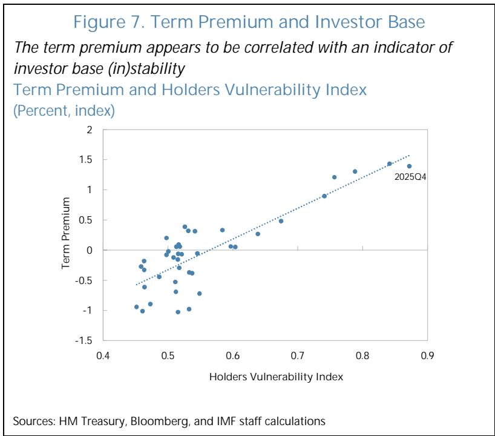

Size and Liquidity of the Market

11. The UK gilt market is less deep and liquid than the largest benchmark markets, which may reduce its resilience to shocks. While similar in size to France and Italy, the UK market is smaller than the US and Japan (Figure 8). Absolute size is an important (but not the only determinant) of market liquidity (McCauley and Remolona, 2000), as there are economies of scale in market-making activities. Smaller, less liquid markets may therefore be more sensitivity to shifts in demand, particularly during periods of stress.

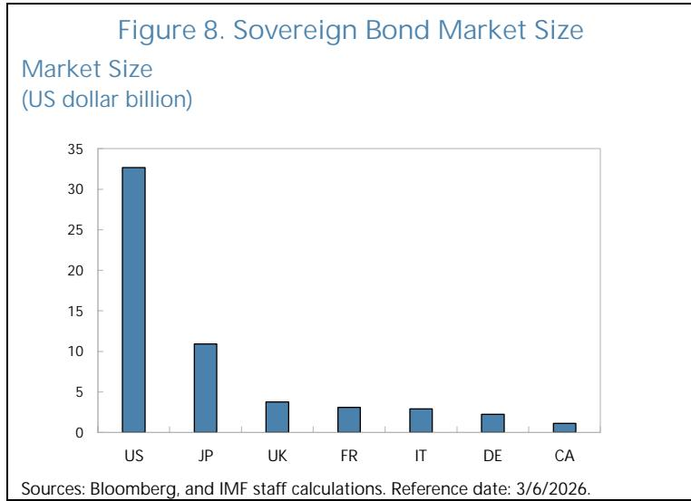

Sovereign Credit Risk

12. Among G7 countries, the UK's debt-to-GDP ratio is toward the lower end of the distribution, although it remains elevated in absolute terms. The debt-to-GDP ratio has risen from around 80 percent before the pandemic to just below 100 percent in recent years (see Figure 9). During and after the pandemic, the BoE absorbed a large share of outstanding government debt through asset purchases, but is currently unwinding these holdings under quantitative tightening.

## Figure 9. Government Debt

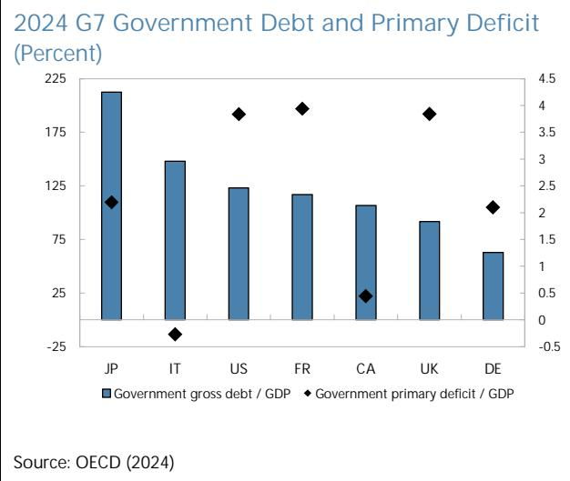

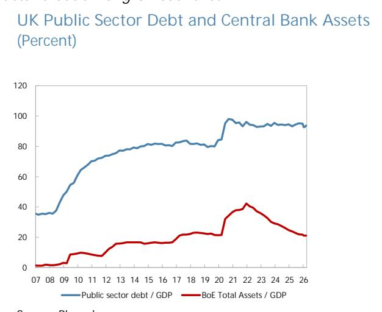  
Source: Bloomberg

13. Over the past two decades, however, the UK's sovereign credit rating has declined from AAA to AA/AA (see Figure 10). Empirically, there is a correlation across advanced economies between sovereign credit ratings and yield curve steepness, as measured by the spread between 10- and 2-year yields. While this spread does not directly capture credit risk, it can be interpreted as a proxy for the term premium, and thus as a broader measure of country risk and uncertainty.

Figure 10. Credit Ratings  
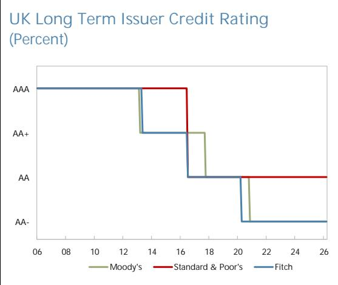

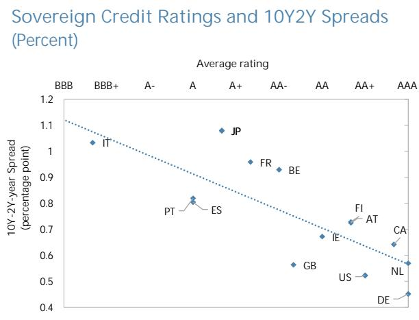  
Legacy of the 2022 Episode: Heightened Sensitivity to Policy Uncertainty?

14. Market feedback suggests that the September 2022 gilt market turmoil marked a structural shift in the fragility of the gilt market. The Economic Policy Uncertainty (EPU) index—capturing domestic policy-related uncertainty—spiked around both the Brexit referendum and the September 2022 gilt market turmoil episode (Figure 11).

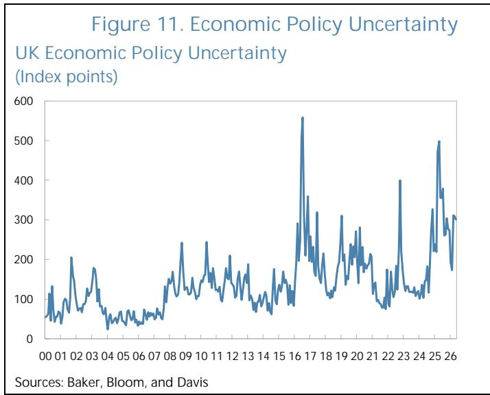

## C. Analysis of Term Premium Drivers and Dynamics

15. This section addresses the puzzle of why UK gilt yields have risen more than those of G7 peers, combining multiple complementary empirical approaches with a focus on the term premium. Understanding the drivers of yields and term premia is central to assessing sovereign

borrowing costs and financial stability risks. The analysis focuses on the term premium as the key object of interest. However, the term premium is a model-based measure and therefore subject to estimation uncertainty and noise. For empirical approaches that are sensitive to such noise—particularly high-frequency or variance-based analyses—observed yields are used instead, as they provide a more robust basis for inference.

16. We combine statistical, structural, and reduced-form approaches, each capturing different but complementary aspects of yield and term premium dynamics (see Table 1). A factor-based analysis extracts common patterns in yield changes and quantifies the relative importance of global and domestic drivers. $^{6}$ A structural Bayesian VAR provides decomposition of the UK term premium into contributions from global and UK-specific shocks based on identified shocks. A G7 panel regression examines cross-country relationships between changes in term premia and macro/credit fundamentals, risk factors, and structural supply-demand factors. A UK-specific time-series regression assesses whether the September 2022 Gilt market turmoil altered term premium dynamics. Finally, a volatility regression examines the relationship between key drivers and UK gilt yield volatility, testing whether market fragility increased after the September 2022 turmoil. While the statistical and reduced-form approaches do not establish causal relationships, taken together, these approaches provide a consistent picture across different methodologies.

<table><tr><td colspan="3">Table 1. United Kingdom: Overview of Empirical Approaches</td></tr><tr><td>Approach</td><td>Objective</td><td>Variable of interest</td></tr><tr><td>Statistical: Factor-model (PCA)</td><td>Assess the time-varying importance of global and domestic factors</td><td>UK yield changes (daily and weekly)</td></tr><tr><td>Structural: Bayesian VAR (BVAR)</td><td>Decompose the UK term premium into contributions from identified global and UK-specific shocks</td><td>UK term premium</td></tr><tr><td>Reduced form: Panel regression of G7 term premia</td><td>Assess empirical relationships between changes in term premia and macroeconomic, risk, and supply-demand factors across G7 economies</td><td>G7 term premia changes (monthly, first differences)</td></tr><tr><td>Reduced form: Time series regression of UK term premium</td><td>Assess time-series relationships between the UK term premium and key drivers, and test whether sensitivities changed after September 2022</td><td>UK term premium changes (monthly, first differences)</td></tr><tr><td>Reduced form: Time series regression of gilt yield volatility</td><td>Assess the relationship between gilt yield volatility and global factors, and test whether sensitivities changed after September 2022</td><td>UK yield volatility (6-month standard deviation of yield changes)</td></tr><tr><td colspan="3">Note: The BVAR, panel, and time-series regressions use the model-implied term premium as the dependent variable. This creates a potential tension, as a latent, model-based variable is related to observed drivers, implying that results may partly reflect properties of the underlying term structure model. By contrast, the PCA and volatility analysis use observed yields, as term premia estimates are too noisy at higher frequencies.</td></tr></table>

## Global Versus Domestic Determinants of Yields

17. Global factors account for the majority of UK yield variation, but their importance varies over time. To assess the relative importance of global and domestic drivers, a principal component analysis (PCA) of G7 yield changes is used to extract the dominant patterns in yield dynamics. The analysis focuses on observed yield changes rather than model-based term premia, as the latter can be sensitive to estimation noise and model specification, which may distort the factor decomposition. The first principal component from a 12-month rolling PCA captures the co-movement in yields across countries and can be interpreted as a global factor. Yield changes are then decomposed into this global component and a residual domestic component, allowing for an assessment of the share of variance explained by global forces for each country.

18. After the September 2022 episode, domestic factors have become more important. Over the period 2020–26, global factors explained between 60 and 90 percent of the variation in gilt yields (see Figure 12). This share declined markedly following the September 2022 episode, particularly for long maturities such as the 30-year yield, indicating a greater role for domestic factors during this period. The importance of the global factor subsequently increased again through 2024, before declining in 2025, when domestic factors regain prominence. Notably, this renewed importance of domestic factors coincided with a period of a widening UK term premium. Using weekly data—less sensitive to day-to-day noise—the impact of the September 2022 gilt market turmoil appears more pronounced, with the importance of global factors declining significantly relative to the pre-episode period.

19. The post-2022 decline in the explanatory power of global factors points to a greater role for UK-specific shocks, with implications for the term premium. This shift is most pronounced at the long end and coincides with a widening in the UK term premium, suggesting that the increased importance of domestic factors is likely to reflect higher compensation for UK-specific risks and uncertainty. In this sense, the PCA results—while based on yields—are consistent with the broader evidence that recent upward pressure on long-term gilt yields has been driven in part by an increase in the term premium rather than by global factors alone.

20. This contrasts with high-frequency market dynamics: from a day-to-day trading perspective, gilt yields can appear relatively sensitive to global shocks, particularly during event-driven episodes. Market participants often describe this as a higher “beta” to global movements, especially since the September 2022 gilt market turmoil. This is most evident at high frequencies: during episodes such as the Middle East conflict, gilt yields exhibited some of the largest moves across G7 markets. However, this pattern is not born over longer horizons. The PCA, based on a 12-month rolling window, shows that the global factor explains only a limited share of variation, as periods of strong co-movement are offset by intervals in which idiosyncratic factors dominate. Over the full sample, there is therefore no clear evidence of a persistently higher sensitivity to global shocks.

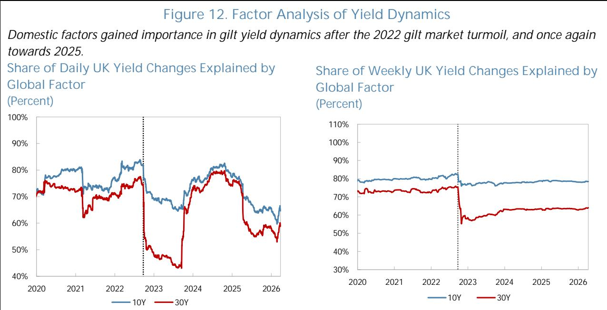  
Sources: Refinitiv Datastream, and IMF Staff Calculations. The global factor refers to the first principal component of a 12-month moving window principal component analysis. The dotted line indicates September 23, 2022, the date at which the "mini-budget" was presented.

Shocks Driving the UK Term Premium, Including Market Imbalances

21. The UK term premium receives contributions from distinct shocks—including global risk, country-specific risk, and demand-related factors—that can be separately identified. To complement the factor-based analysis, a Bayesian vector autoregression (BVAR) with sign restrictions is employed to identify these shocks and assess their cumulative impact on the UK term premium. Intuitively, the BVAR uses the co-movement of financial variables to infer the underlying shocks driving the term premium, allowing past movements to be decomposed into contributions from different sources. Identification is achieved using sign restrictions on the responses of key variables—imposing economically motivated patterns on how variables react to shocks—following an approach similar to Brandt and others (2023), using the BEAR toolbox developed by Dieppe, van Roye and Legrand (2016). The model is estimated using daily data and includes UK and US term premia, UK and US corporate credit spreads, the GBP/USD exchange rate, and the 10-year swap spread. Global risk shocks are characterized by widening corporate spreads and a strengthening of the US dollar, while global term premium shocks are associated with simultaneous increases in UK and US term premia (Table 2). UK- and US-specific risk shocks are identified by increases in the respective country's term premia and corporate spreads, with US risk shocks also leading to dollar appreciation. In addition, a structural shock is identified by an increase in the UK term premium combined with a decline in the UK swap spread, $^{7}$ interpreted as reflecting weaker demand for gilts and potential supply-demand imbalances.

<table><tr><td colspan="6">Table 2. United Kingdom: BVAR Sign Restrictions</td></tr><tr><td></td><td>Global Risk</td><td>Global Term Premium</td><td>UK Risk</td><td>US Risk</td><td>Structural demand/supply</td></tr><tr><td>UK term premium</td><td></td><td>+</td><td>+</td><td></td><td>+</td></tr><tr><td>US term premium</td><td></td><td>+</td><td></td><td>+</td><td></td></tr><tr><td>US corporate spread</td><td>+</td><td></td><td></td><td>+</td><td></td></tr><tr><td>UK corporate spread</td><td>+</td><td></td><td>+</td><td></td><td></td></tr><tr><td>UK swap-spread</td><td></td><td></td><td></td><td></td><td>-</td></tr><tr><td>GBBUSD</td><td>-</td><td></td><td>-</td><td></td><td></td></tr><tr><td colspan="6">Note: corporate spreads are the Z-spreads to the sovereign curve taken from the US and UK Bloomberg investment grade corporate bond indices. The swap spread is the difference between the 10-year SONIA overnight-indexed swap rate and the 10-year UK gilt yield. The swap spread is indicative of demand conditions in the gilt market, with a decline in the swap spread suggesting weaker demand for government bonds relative to swaps and potential supply-demand imbalances. Under a global risk shock, the US dollar is assumed to strengthen, whilst corporate spreads widen. A global term premium shock reflects a common increase in term premia. A US/UK-specific risk shock drives up US/UK risk premia. The pound sterling weakens versus the US dollar under a UK risk shock. Lastly, structural demand/supply shocks are assumed to drive up the UK term premium, while reducing the swap-spread.</td></tr></table>

22. Structural supply-demand imbalances appear to have exerted more upward pressure on the UK term premium since 2024. The BVAR analysis shows how identified shocks contribute to movements in the term premium over time (see Figure 13). $^{8}$ To assess the economic plausibility of the decomposition, we examine key recent episodes. In early 2021, rising global inflationary pressures were reflected in a prominent contribution from global term premium shocks. Around the September 2022 episode, UK-specific risk shocks dominated, driving a sharp increase in the UK term premium. In the period from the beginning of 2024 to the end of 2025—when the term premium drove a wedge between long-term yields and the expected path of short rates—the decomposition points to a combination of shocks, with roughly equal contributions from global and UK-specific factors. Notably, the role of UK-specific risk shocks increased in late 2024, while spillovers from US risk shocks also contributed. Structural demand/supply shocks became more prominent from 2024 onwards (moving from negative to positive). This could reflect a range of mechanisms, including shifts in the investor base (e.g. from pension funds or central bank holdings toward more price-sensitive investors), increased net supply associated with issuance or quantitative tightening, or constraints in market intermediation and liquidity. These mechanisms, however, cannot be separately identified within the model.

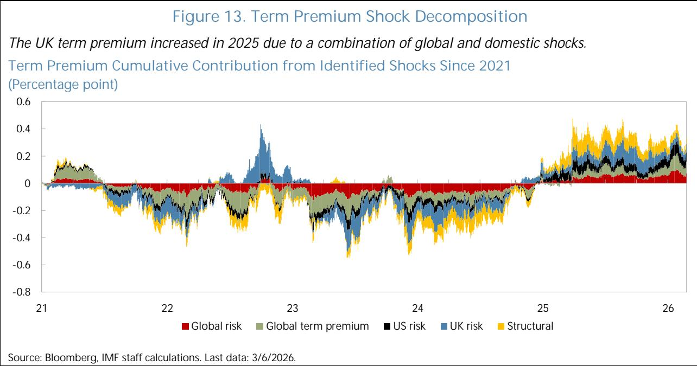

## A Cross-Country Perspective on Supply-Demand Factors

23. A cross-country panel regression is used to examine the relationship between term premia and macroeconomic, risk, and structural supply-demand factors across G7 countries. Variables are grouped into three categories: macro-credit factors, sources of uncertainty, and structural supply-demand conditions (Table 3). The analysis is subject to several limitations. Many candidate drivers co-move over time, making it difficult to disentangle their individual effects on term premia. Data availability and frequency differ across variables and jurisdictions, complicating the construction of a consistent panel dataset. In addition, the relatively small G7 sample limits statistical power; expanding the sample could increase observations, but the inclusion of smaller or emerging economies may introduce structural differences that obscure core patterns. Accordingly, the results are best interpreted as identifying correlations rather than causal relationships. Within this framework, a set of representative variables is selected for each category (Table 3). Macro-credit factors include purchasing managers' indices (PMIs), capturing forward-looking growth expectations, and debt-to-GDP ratios, adjusted by scaling debt to trend GDP to reduce cyclical distortions. Measures of uncertainty include the VIX as a proxy for global risk sentiment, inflation uncertainty (measured as the moving average deviation of CPI outcomes from expectations), and economic policy uncertainty based on the Baker-Bloom-Davis methodology. Structural supply and demand factors are proxied by net government debt issuance, central bank holdings relative to outstanding government debt, and pension fund assets relative to government bonds.

<table><tr><td colspan="2">Table 3. United Kingdom: G7 Panel Regression</td></tr><tr><td colspan="2"> $\Delta Y_{i,t}^{n} = \alpha_{i} + \beta_{t} + \overbrace{\gamma^{T}\Delta X_{i,t}}^{Macro/credit factors} + \overbrace{\theta^{T}\Delta A_{i,t}}^{Sources of Uncertainty} + \overbrace{\beta^{T}\Delta Z_{i,t}}^{Structural demand/supply} + \varepsilon_{i,t}$ </td></tr><tr><td>Macro/credit factors:</td><td>Purchase Managers Index (lagged)Debt-to-trend-GDP ratio</td></tr><tr><td>Sources of Uncertainty:</td><td>Equity Implied Volatility (VIX)Inflation uncertainty (average 6-month deviation of y/y CPI from survey expectation, lagged)Economic Policy Uncertainty (Baker-Bloom-Davis)</td></tr><tr><td>Structural demand/supply:</td><td>Net issuance / percentage change in nominal amount of government debt outstandingCentral bank assets: ratio of central bank assets over the amount of government debt outstandingPension fund assets: ratio of pension fund assets over the amount of government debt outstanding</td></tr><tr><td colspan="2">Quarterly and annual data are interpolated to a monthly frequency where needed. The dataset spans 2000–2025 at a monthly frequency. Regression results are reported in the Annex.  $\alpha_{i}$  and  $\beta_{t}$  reflect country and time fixed effects, respectively.</td></tr></table>

24. Overall, the results highlight the importance of supply-demand dynamics—particularly net issuance flows—in shaping term premia across advanced economies, while also pointing to a stabilizing role of long-term institutional investors. Regression results point to a consistent role of both global risk and supply factors. In a levels regression, interpreted with caution due to potential spurious trends, the VIX and net issuance are positively associated with term premia, while larger central bank balance sheets are associated with lower term premia (see Figure 14). A more informative first-differences specification confirms a robust positive relationship between net issuance and term premia, alongside a continued role for the VIX. There is also some evidence that stronger growth expectations (proxied by lagged PMIs) are associated with a higher term premium. In contrast, increases in pension fund assets are associated with lower term premia, consistent with their role as stable long-term investors, while the effect of central bank flows is not statistically significant at conventional levels. Annex Table 7 provides a sense of the economic significance of relevant drivers (confidence intervals indicated in the table). A percent increase (over 3 months) of the outstanding amount of debt through net issuance is associated with a 3.8 basis points increase of the term premium. A one percentage point increase in the pension fund holdings of gilts is associated with a 5.4 basis points decrease of the term premium.

Figure 14. Panel Regression Coefficients  
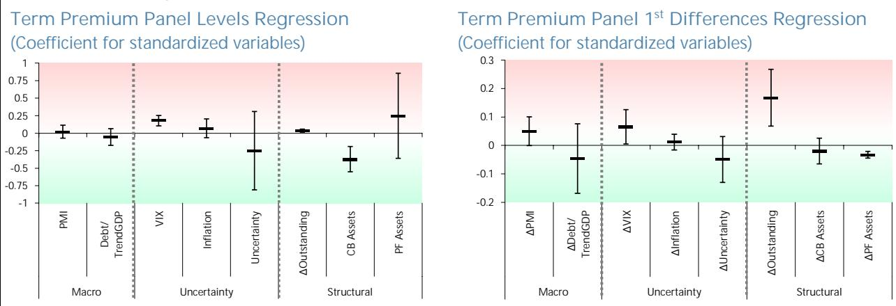  
Sources: Bloomberg, Refinitiv Datastream, OECD, Haver, and IMF staff calculations. Whiskers indicate 95 percent confidence intervals. Variables have been standardized (mean of zero, standard deviation of one) to assess the relative strength of the relationship between each variable and the term premium. Full regression tables can be found in the annex.  
The Role of Domestic Uncertainty  
25. The relationship between the UK term premium and domestic policy uncertainty is assessed using a UK-specific time-series regression. The analysis includes the key driver identified in the panel analysis—net issuance—and is augmented with a measure of policy uncertainty (Table 4). To test for changes in sensitivities, policy uncertainty is interacted with a post-2022-turmoil dummy.

26. The results indicate that, following the September 2022 episode, the UK term premium became significantly more sensitive to domestic policy uncertainty (see Figure 15). This supports market commentary suggesting that investors began to assign a higher risk premium to perceived policy uncertainty. Economically speaking, a one standard deviation change in the monthly EPU (80 index points) is associated with a 4.6 bps increase in the term premium, after the September 2022 gilt market turmoil. $^{9}$

<table><tr><td colspan="2">Table 4. United Kingdom: Term Premium Regression</td></tr><tr><td colspan="2">ΔTerm Premium = α + β · net issuance + γ · ΔEPU + δ · postSep.2022 + θ · postSep.2022 · ΔEPU</td></tr><tr><td>Net issuance</td><td>3-month moving window change in nominal amount of government bonds outstanding, in percent</td></tr><tr><td>EPU = Economic Policy Uncertainty</td><td>UK specific index following Baker-Bloom-Davis</td></tr><tr><td>postSep.2022</td><td>Dummy, takes value 0 before September 2022, 1 during &amp; afterwards</td></tr></table>

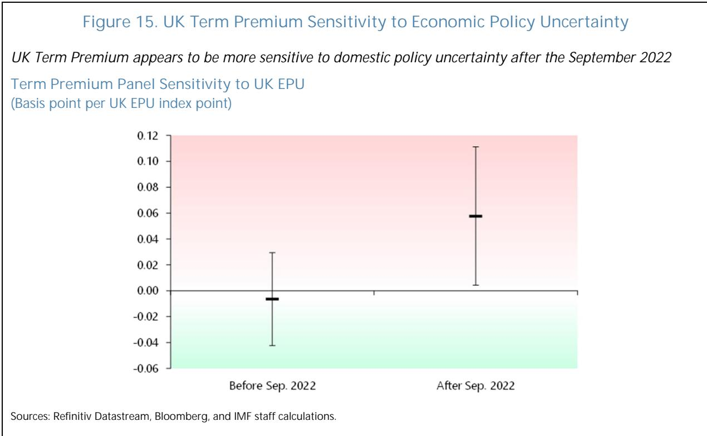

Impact of the 2022 Episode on Gilt Yield Volatility

27. The September 2022 gilt market turmoil also appears to have increased the sensitivity of gilt yield volatility to global shocks. To assess this, UK gilt yield volatility—measured as a six-month moving standard deviation of yield changes—is regressed on US Treasury yield volatility and global risk (proxied by the VIX), with interaction terms capturing the period after September 2022 (Table 5). Similar to the PCA analysis, yields instead of term premia are used in this exercise, as model-based term premia introduce estimation noise that can distort high-frequency volatility measures. The results indicate that, following the episode, US yield volatility is more strongly associated with gilt volatility, and that gilt yields have become more responsive to global risk conditions (see Figure 16). While these relationships cannot be interpreted causally, they point to a more fragile market environment in which volatility is transmitted more readily across markets.

<table><tr><td colspan="3">Table 5. United Kingdom: Volatility Regression</td></tr><tr><td colspan="3"> $\sigma_{t}^{UK}= \alpha + \beta \cdot \sigma_{t}^{US} + \delta \cdot post_{t} + \gamma \cdot (post_{t} \cdot \sigma_{t}^{US}) + \theta \cdot VIX_{t} + \sigma \cdot (post_{t} \cdot VIX_{t}) + \varepsilon_{t}$ </td></tr><tr><td></td><td>Before Sep. 2022</td><td>After Sep. 2022</td></tr><tr><td>Relationship with US volatility:</td><td> $\beta$ </td><td> $\beta + \gamma$ </td></tr><tr><td>Relationship with global risk (VIX):</td><td> $\theta$ </td><td> $\theta + \sigma$ </td></tr></table>

Figure 16. Gilt Yield Volatility  
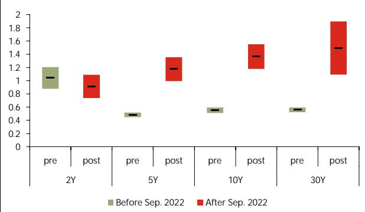  
Sources: Bloomberg, and IMF staff calculations.

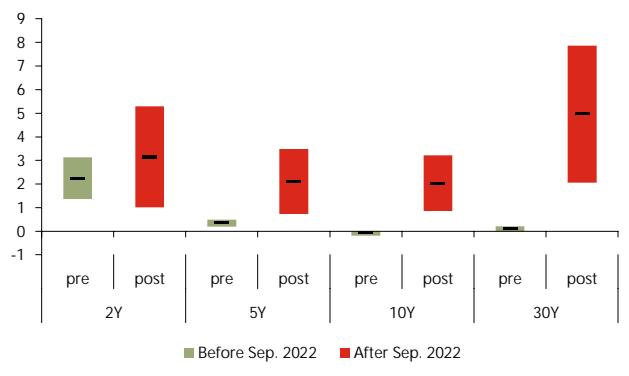

## Summary of Results

28. This section summarizes the main empirical findings and their consistency across approaches (see Table 6). Across complementary empirical methods, the evidence points to a coherent set of drivers behind the rise in the UK term premium across two dimensions: (1) a gradual long-term structural change in demand-supply conditions in the gilt market; and (2) a regime shift after the September 2022 gilt market turmoil, after which the UK domestic risk started to play a more important role as a driver of the term premium and gilt markets became more prone to volatility spikes.

29. One explanation for the rise in the UK term premium relates to structurally tighter supply-demand conditions in the market for longer-term bonds. Across all our empirical approaches, increases in net issuance are consistently associated with a higher term premium, while the higher term premium also appears to align with declining structural demand for long-term bonds, and a shift toward more price-sensitive investors. The footprint of long-term institutional investors—such as pension funds and central banks—which have historically exerted a stabilizing effect, has become much smaller.

30. Another explanation is that the September 2022 gilt market turmoil seems to mark a regime shift in how shocks are transmitted into gilt yields. The analysis points to two distinct changes in gilt market dynamics: first, a stronger role for domestic factors in determining the level of the term premium; and second, a greater propensity for the market to shift into high-volatility regimes.

\- Domestic factors—notably economic policy uncertainty—have become a more important driver of the term premium. The PCA shows a clear decline in the share of gilt yield variation explained by the global factors after September 2022, indicating a greater role for domestic influences. In parallel, the time-series evidence shows that the term premium has become more sensitive to UK economic policy uncertainty.

\- Gilt markets also appear more prone to shifts into high-volatility regimes. After the September 2022 episode, gilt market volatility shows a stronger association with US Treasury market volatility and the VIX index. A higher propensity to enter high-volatility regimes signals fragility because small shocks can trigger larger price moves, reflecting weak intermediation and limited shock absorption. These moves can become self-reinforcing through forced deleveraging, which amplifies and prolongs instability.

31. Evidence for other factors seems less robust or of limited policy relevance. In the G7 panel regression, the VIX is positively associated with the term premium, but it reflects exogenous global conditions and serves primarily as a control, offering limited policy insight. Other variables are not consistently significant across specifications, but in some cases this may reflect data limitations such as low frequency or measurement errors. For example, changes in central bank assets are not found to have a significant association with the term premium; however, more detailed data—such as outright government bond holdings—could be more informative for further analysis (if available). Our recommendations focus on policy actionable insights that find stronger support across multiple approaches.

<table><tr><td colspan="3">Table 6. United Kingdom: Summary of Findings</td></tr><tr><td>Approach</td><td>Key Result</td><td>Interpretation</td></tr><tr><td>Factor model (PCA)</td><td>Global factors explain most yield variation, but their importance declines after September 2022</td><td>September 2022 had a profound impact in what drives gilt yields</td></tr><tr><td>Structural: BVAR</td><td>Structural supply-demand shocks contribute notably to recent term premium increases</td><td>Changes in investor base and issuance conditions are relevant drivers</td></tr><tr><td>Panel regression (G7)</td><td>Term premia are positively associated with global risk (VIX) and net issuance; pension funds reduce premia</td><td>Global risk and supply dominate; long-term investors stabilize markets</td></tr><tr><td>UK time-series regression</td><td>Sensitivity of term premia to policy uncertainty increases after 2022</td><td>Greater role for domestic risk and policy credibility</td></tr><tr><td>Volatility regression</td><td>Gilt volatility becomes more sensitive to US volatility and global risk after 2022</td><td>Increased cross-market transmission and market fragility</td></tr></table>

## D. Discussion and Recommendations

32. Policy responses should target the underlying economic drivers of elevated gilt yields. The analysis points to drivers across two dimensions: first, gradual long-term changes in structural demand-supply conditions in the gilt market, and second, a regime-shift after the September 2022 gilt market turmoil. Effective policy responses should therefore focus on mitigating these pressures and strengthening the market's capacity to absorb them. $^{10}$

33. First, reducing the volume and adjusting the composition of gilt supply can help limit upward pressure on the term premium. The analysis shows that higher net gilt issuance is associated with a higher term premium, which may also be impacted by the weaker structural demand for long-dated gilts. Policymakers should therefore focus on three channels: reducing issuance needs through fiscal consolidation, adapting the maturity and instrument composition of issuance to market demand, and ensuring that quantitative tightening does not unnecessarily amplify bond-supply pressures.

\- Staying the course on planned fiscal consolidation is key to limiting the amount of net gilt issuance. The fiscal adjustment that began last year aims to stabilize net debt over the medium term and is underpinned by the June 2025 Spending Review. With elevated debt and gilt market pressures, delivering the planned deficit reduction requires a cautious approach to new spending pressures, including further prioritization where needed without raising fiscal deficit targets, and the development of contingency plans on both the tax and revenue sides should the consolidation be pushed off course.

\- The issuance composition should continue to be calibrated to avoid concentrating supply in segments of the curve with limited absorption capacity. The DMO is already taking steps in this direction: it has shortened the maturity of its issuance, reduced the share of index-linked gilts, $^{11}$ concluded a consultation on bill issuance, $^{12}$ and is considering switch auctions $^{13}$ that could support liquidity in the long end of the curve. Maturity shortening can increase rollover-risk, which can be limited by staying the course on the planned fiscal consolidation, however.

• Balance sheet normalization should be conducted in a way that does not unnecessarily amplify supply-demand imbalances. The BoE is reducing its gilt holdings under the Asset Purchase Facility (APF), but this has the effect of increasing the amount of gilts to be absorbed by the market. While frequent adjustment to quantitative tightening QT should be avoided as it risks undermining the role of the Bank rate as the active tool of monetary policy, it should nevertheless be implemented in a manner that preserves market stability, including by following a predictable and pre-determined path. $^{14}$ In addition, given the changing investor base and reduced structural demand for long-term gilts, skewing the sales away from longer maturity gilts could be considered if market conditions warrant.

34. Second, policy credibility and predictability are key to strengthening market confidence and reversing the impact of the September 2022 episode. Clear communication and well-signaled policy changes can anchor expectations and reduce the risk of sharp repricing in sovereign yields. Recent reforms have strengthened the stability and credibility of fiscal policy. In line with past Article IV recommendations, the authorities did not announce any new measures in the spring, making the Fall budget the sole fiscal event, and the Office for Budget Responsibility now only assesses rule compliance at the time of the Fall budget. This has signifyingly reduced speculation about interim fiscal adjustments. In addition, the fiscal buffers have been increased. Managing the risks to the medium-term consolidation path in a more shock-prone world and a proactive approach to dealing with longer term spending pressures would help strengthen credibility and support market confidence. Beyond the fiscal strategy, the authorities should sustain the implementation of their structural reform agenda. The economic payoff from many structural reforms will materialize only gradually, and credibility will ultimately hinge on sustained delivery.

35. Finally, enhancing resilience in the broader core funding market ecosystem is critical to improving the gilt market's capacity to absorb shocks. Constraints in intermediation—reflecting repo market functioning, dealer balance sheet capacity, and the broader institutional framework—affect how smoothly gilt flows are absorbed and how strongly shocks are reflected in yields. Evidence from the System Wide Exploratory Scenario (SWES) shows that individual actions can collectively amplify shocks through procyclical asset sales in combination with limited intermediation. While post-2022 reforms, particularly for LDI funds, have improved resilience, these gains may not be sufficient. The exercise also underscores the central role of repo markets, whose capacity to absorb stress is critical. The FPC has received feedback on its discussion paper on gilt repo market resilience, $^{15}$ and the BoE intends to publish a comprehensive update, including potential policy proposals, in early 2027.

## Annex I. Supplementary Data and Empirical Results

## A. Data Set

<table><tr><td colspan="5">Table I.1 United Kingdom: Data Set</td></tr><tr><td>Variable</td><td>Start date</td><td>End date</td><td>Frequency</td><td>Source</td></tr><tr><td>Term premium</td><td>Feb-99</td><td>Nov-25</td><td>Daily</td><td>Bloomberg, IMF staff calculations</td></tr><tr><td>Debt/GDP</td><td>Mar-00</td><td>Dec-25</td><td>Quarterly</td><td>Refinitiv</td></tr><tr><td>Central bank assets</td><td>Jan-00</td><td>Nov-25</td><td>Monthly</td><td>Haver</td></tr><tr><td>Pension fund assets</td><td>Dec-06</td><td>Dec-24</td><td>Annual</td><td>OECD</td></tr><tr><td>Inflation uncertainty</td><td>Dec-03</td><td>Dec-25</td><td>Monthly</td><td>Bloomberg, IMF staff calculations</td></tr><tr><td>GDP (nominal)</td><td>Mar-00</td><td>Dec-25</td><td>Quarterly</td><td>Haver</td></tr><tr><td>Economic policy uncertainty</td><td>Jan-00</td><td>Dec-25</td><td>Monthly</td><td>www.policyuncertainty.com</td></tr><tr><td>Government bonds outstanding</td><td>Mar-00</td><td>Sep-25</td><td>Quarterly</td><td>Haver</td></tr><tr><td>PMI</td><td>Aug-01</td><td>Dec-25</td><td>Monthly</td><td>Bloomberg</td></tr><tr><td>VIX</td><td>Jan-00</td><td>Dec-25</td><td>Monthly</td><td>Bloomberg</td></tr></table>

## B. Additional Stylized Facts

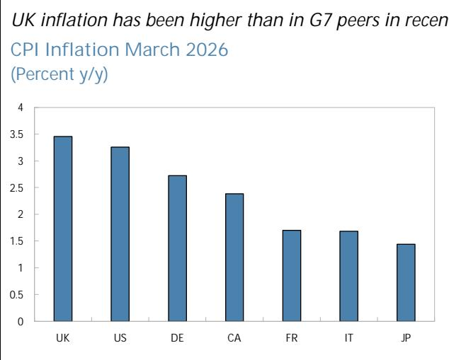  
Source: IMF.

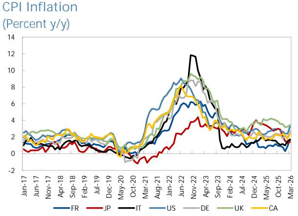

The UK's policy rate has also been on the upper end of the G7 range over the past years  
Figure I.2. Policy Rates  
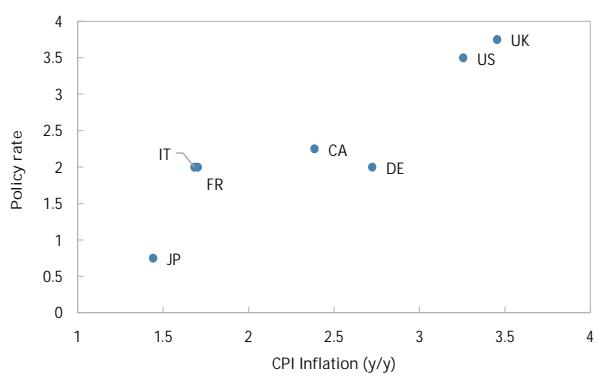  
Sources: Bloomberg, and IMF.

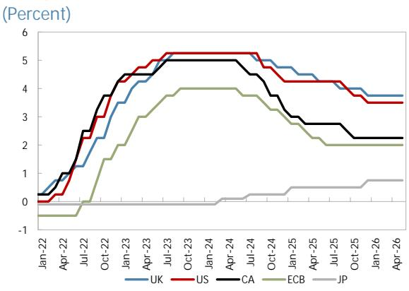

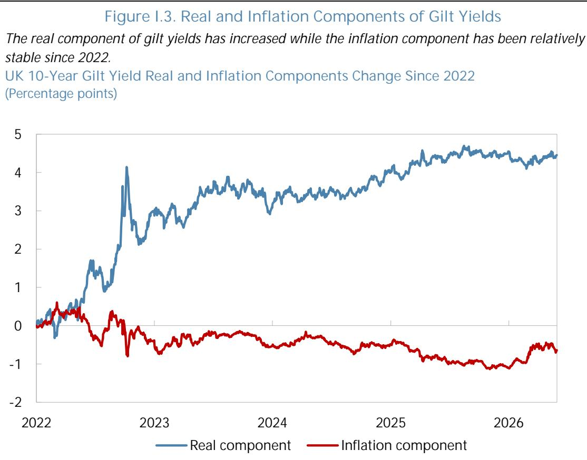

Figure I.4. Swap Spread  
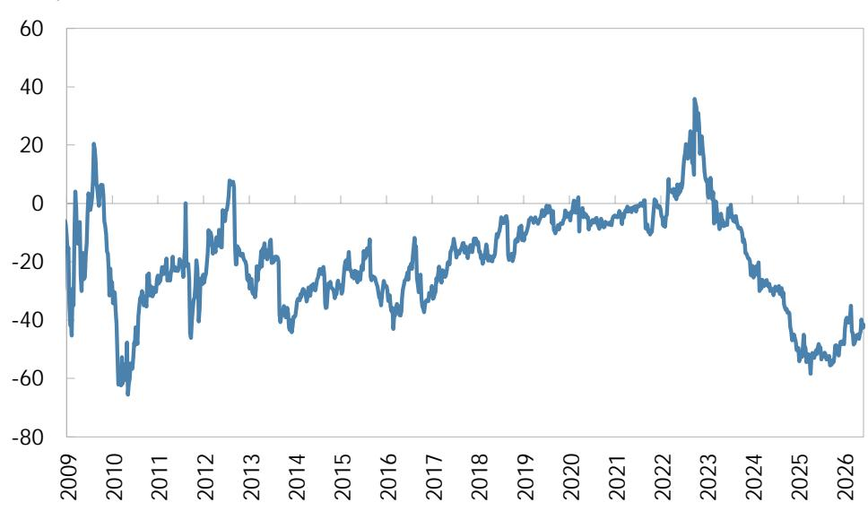  
Sources: Bloomberg, and IMF staff calculations. The swap spread is computed as the difference between the 10-year SONIA swap rate and the 10-year gilt yield.

Figure I.5. Projected Gilt Holdings of the Pensions Sector  
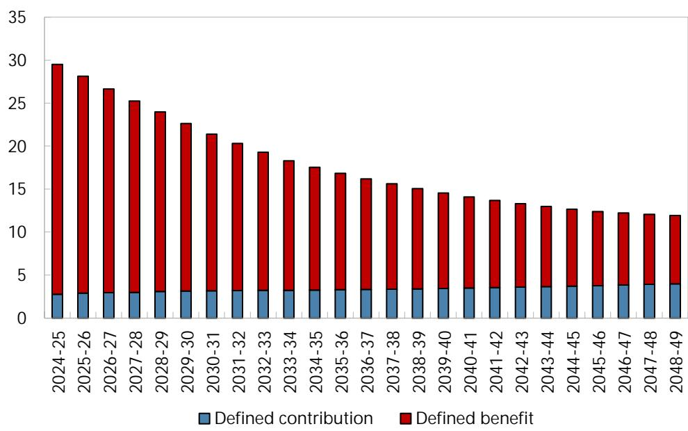  
Source: Office for Budget Responsibility (2025).

## C. Background on G7 Panel Regression

<table><tr><td colspan="4">Table I.2. United Kingdom: G7 Panel Regression</td></tr><tr><td colspan="4">Panel regression with dependent variable term premium. G7, monthly data</td></tr><tr><td></td><td>(1)</td><td>(2)</td><td>(3)</td></tr><tr><td></td><td>Macro</td><td>Macro+Uncertainty</td><td>Macro+Uncertainty+Structural</td></tr><tr><td> $\Delta PMI_{t-1}$ </td><td>0.001</td><td>0.001</td><td>0.002*</td></tr><tr><td></td><td>(0.001)</td><td>(0.001)</td><td>(0.001)</td></tr><tr><td></td><td></td><td></td><td></td></tr><tr><td> $\Delta \left( \frac{Debt_t}{GDP_t^{trend}} \right)$ </td><td>0.000</td><td>-0.000</td><td>-0.000</td></tr><tr><td></td><td>(0.000)</td><td>(0.000)</td><td>(0.000)</td></tr><tr><td></td><td></td><td></td><td></td></tr><tr><td> $\Delta VIX_t$ </td><td></td><td>0.002*</td><td>0.002*</td></tr><tr><td></td><td></td><td>(0.001)</td><td>(0.001)</td></tr><tr><td></td><td></td><td></td><td></td></tr><tr><td> $\Delta U_t^{inflation}$ </td><td></td><td>0.040</td><td>0.053</td></tr><tr><td></td><td></td><td>(0.069)</td><td>(0.063)</td></tr><tr><td></td><td></td><td></td><td></td></tr><tr><td> $\Delta U_t^{policy}$ </td><td></td><td>-0.000</td><td>-0.000</td></tr><tr><td></td><td></td><td>(0.000)</td><td>(0.000)</td></tr><tr><td></td><td></td><td></td><td></td></tr><tr><td>Net issuance</td><td></td><td></td><td>3.763**</td></tr><tr><td></td><td></td><td></td><td>(1.142)</td></tr><tr><td></td><td></td><td></td><td></td></tr><tr><td> $\Delta \left( \frac{CB Assets_t}{Gov. Bonds_t} \right)$ </td><td></td><td></td><td>-0.108</td></tr><tr><td></td><td></td><td></td><td>(0.128)</td></tr><tr><td></td><td></td><td></td><td></td></tr><tr><td> $\Delta \left( \frac{PF Assets_t}{Gov. Bonds_t} \right)$ </td><td></td><td></td><td>-5.410***</td></tr><tr><td></td><td></td><td></td><td>(0.995)</td></tr><tr><td></td><td></td><td></td><td></td></tr><tr><td>Constant</td><td>-0.003***</td><td>-0.002***</td><td>-0.003***</td></tr><tr><td></td><td>(0.000)</td><td>(0.000)</td><td>(0.000)</td></tr><tr><td>Observations</td><td>2138.000</td><td>1947.000</td><td>1802.000</td></tr><tr><td>R-squared</td><td>0.002</td><td>0.006</td><td>0.036</td></tr><tr><td colspan="4">Notes: Standard errors in parentheses. Country FE included. SE clustered at country level.*p&lt;0.10, **p&lt;0.05, ***p&lt;0.01</td></tr></table>

## D. Background on UK Time Series Regression

<table><tr><td colspan="2">Table I.3. United Kingdom: Term Premium Regression</td></tr><tr><td colspan="2">Time series regression, UK, Monthly Data, Dependent Variable Term Premium</td></tr><tr><td></td><td>(1)</td></tr><tr><td></td><td>D.tp</td></tr><tr><td>Net issuance</td><td>4.068***</td></tr><tr><td></td><td>(1.001)</td></tr><tr><td> $\Delta U_{t}^{policy}$ </td><td>-0.006</td></tr><tr><td></td><td>(0.018)</td></tr><tr><td>post $_{Sep.2022}$ </td><td>1.111</td></tr><tr><td></td><td>(1.794)</td></tr><tr><td>post $_{Sep.2022}$  x  $\Delta U_{t}^{policy}$ </td><td>0.064**</td></tr><tr><td></td><td>(0.026)</td></tr><tr><td>Constant</td><td>0.090</td></tr><tr><td></td><td>(0.788)</td></tr><tr><td>Observations</td><td>304.000</td></tr><tr><td colspan="2">Notes: Standard errors in parentheses. Newey-West standard errors (lag 4). Includes issuance (3-month change) and policy uncertainty interaction with a dummy that takes the value of 1 during and after September 2022.* p &lt; 0.10, ** p &lt; 0.05, *** p &lt; 0.01</td></tr></table>

## E. Background on UK BVAR Analysis

The BVAR sample consists of daily data spanning 2004-2026. Sign-restrictions (Table 2) are imposed on the first two periods of the impulse response functions (0-2). The analysis uses a standard Minnesota prior, and a 4-period lag-structure.

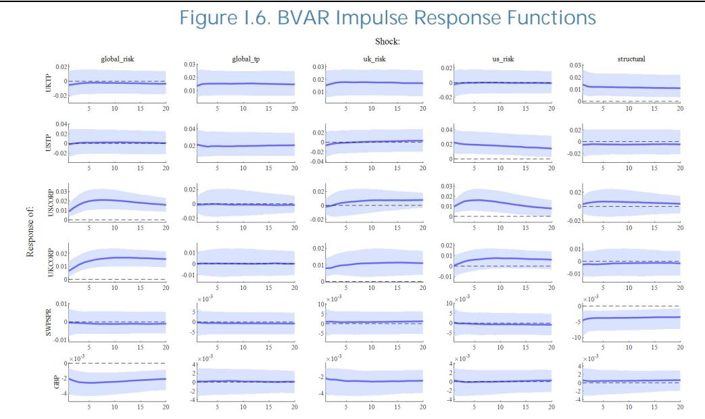  
Sources: Bloomberg, and IMF staff calculations using the BEAR Toolbox (Dieppe, van Roye and Legrand, 2016).

## References

Adrian, Tobias, Richard K. Crump, and Emanuel Moench. 2013. Pricing the Term Structure with Linear Regressions. Journal of Financial Economics, 110(1), 110–138.

Baker, Scott R. & Nicholas Bloom & Steven J. Davis, 2015. "Measuring Economic Policy Uncertainty," CEP Discussion Papers dp1379, Centre for Economic Performance, LSE.

Brandt, Lennart & Saint Guilhem, Arthur & Schröder, Maximilian & Van Robays, Ine, 2021. "What drives euro area financial markets? The role of US spillovers and global risk," Working Paper Series 2560, European Central Bank.

Cochrane, John H., and Monika Piazzesi. 2005. Bond Risk Premia. American Economic Review, 95(1), 138–160.

Dieppe, Alistair & van Roye, Björn & Legrand, Romain, 2016. "The BEAR toolbox," Working Paper Series 1934, European Central Bank.

Don H. Kim & Jonathan H. Wright, 2005. "An arbitrage-free three-factor term structure model and the recent behavior of long-term yields and distant-horizon forward rates," Finance and Economics Discussion Series 2005-33, Board of Governors of the Federal Reserve System (U.S.).

Giese, Julia, Michael Joyce, Jack Meaning and Jack Worlidge (2023). "Preferred habitat investors in the UK government bond market", Bank of England Staff Working Paper No. 939

Greenwood, R and Vissing-Jorgensen, A., "The Impact of Pensions and Insurance on Global Yield Curves", Harvard Business School, Working Paper 18-109, 2018.

Hanson, Samuel G. & Stein, Jeremy C., 2015. "Monetary policy and long-term real rates," Journal of Financial Economics, Elsevier, vol. 115(3), pages 429-448.
https://doi.org/10.1016/j.jfineco.2014.11.001

International Monetary Fund (2025), October 2025 Global Financial Stability Report, Annex 1.7. https://www.imf.org/-/media/files/publications/gfsr/2025/october/english/ch1annex.pdf

Kadiric S, (2022). The determinants of sovereign risk premiums in the UK and the European government bond market: the impact of Brexit. Int Econ Econ Policy. 2022;19(2):267-298.

Kaminska, Iryna and Haroon Mumtaz (2022). Monetary policy transmission during QE times: role of expectations and term premia channels. Bank of England Staff Working Paper No. 978

Krishnamurthy, A., Vissing-Jorgensen, A., Gilchrist, S., & Philippon, T. (2011). The Effects of Quantitative Easing on Interest Rates: Channels and Implications for Policy [with Comments and Discussion]. Brookings Papers on Economic Activity, 215–287.
http://www.jstor.org/stable/41473600

Leippold, Markus, Felix Matthys, Economic Policy Uncertainty and the Yield Curve, Review of Finance, Volume 26, Issue 4, July 2022, Pages 751–797, https://doi.org/10.1093/rof/rfac031

Lengyel, Andras (2026). Government bond issuance surprises and the term structure of interest rates in the UK, Journal of Banking & Finance, Volume 189, 2026, 107715

McCauley, Robert and Eli Remolona, 2000. "Size and liquidity of government bond markets," BIS Quarterly Review, Bank for International Settlements, November.

Office for Budget Responsibility (2025). "Fiscal risks and sustainability". CP 1343, July 2025

Organisation for Economic Co-operation and Development (2026). "Global Debt Report 2026". 4 March 2026

Panigrahi, Lisa and Amarjot Sidhu, 2026. "What were the drivers of UK long-term interest rates in 2025?", Bank of England. https://www.bankofengland.co.uk/bank-insights/2026/what-were-the-drivers-of-uk-long-term-interest-rates-in-2025

Robin Greenwood, Dimitri Vayanos, Bond Supply and Excess Bond Returns, The Review of Financial Studies, Volume 27, Issue 3, March 2014, Pages 663–713, https://doi.org/10.1093/rfs/hht133

Silvia Miranda-Agrippino, Hélène Rey, U.S. Monetary Policy and the Global Financial Cycle, The Review of Economic Studies, Volume 87, Issue 6, November 2020, Pages 2754–2776, https://doi.org/10.1093/restud/rdaa019

Stehn, Sven Jari (2025). "How Vulnerable are the UK's Public Finances?" Goldman Sachs Research, 26 September 2025

Vayanos, D. and Vila, J.-L. (2021), A Preferred-Habitat Model of the Term Structure of Interest Rates. Econometrica, 89: 77-112. https://doi.org/10.3982/ECTA17440