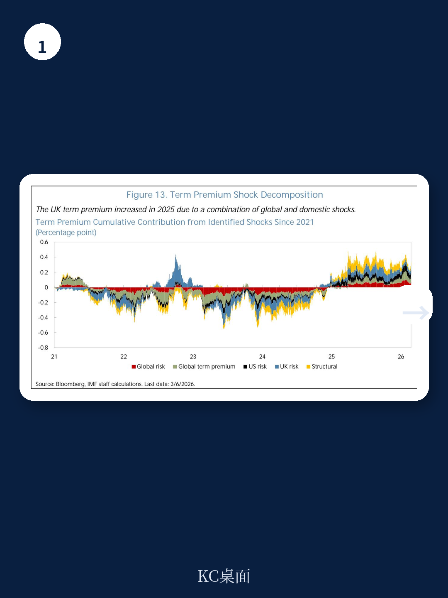
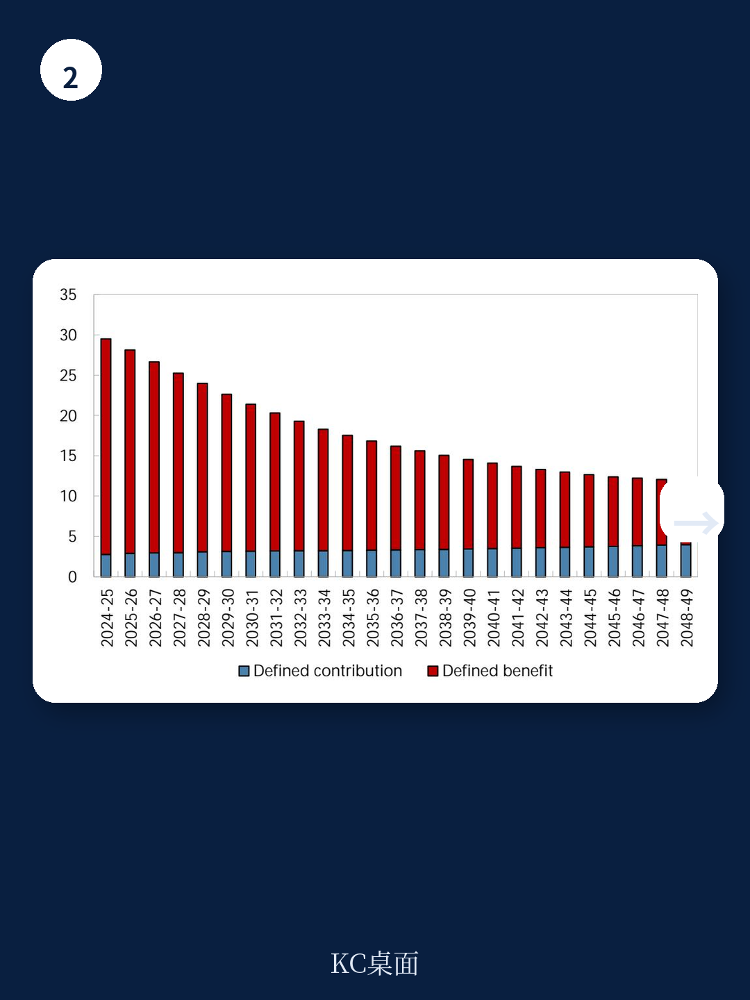

# IMF：英国国债回报业务与近期数据观察

2022年以来，英国国债回报表现——尤其是长端——持续抬升并超过G7其他地区。IMF在2026年7月发布的国别报告中拆解了这一现象的构成：长期回报表现上升并非单纯由货币政策预期推动，期限溢价——即超出短期利率预期路径的不确定性补偿——才是主要变量。报告基于2022年9月英国国债市场动荡前后的数据对比，识别出两类驱动因素：读者结构长期变化带来的供需条件调整，以及市场动荡后国内不确定性因素权重的上升。

报告的核心判断是，英国期限溢价的抬升并非单一因素所致，而是结构性需求变化与市场机制转变的叠加结果。对于观察英国财政可持续性和市场定价的读者来说，这份报告提供了一个清晰的拆解框架：哪些是慢变量，哪些是2022年后的新变化。

## 1. 英国国债读者结构变化与期限溢价呈正相关

英国国债市场的独特之处在于其超长平均久期。报告数据显示，英国主权债务的加权平均期限接近14年，而其他G7国家普遍在6至9年之间。这一结构长期依赖国内固定收益养老金部门的稳定需求——该部门对长久期和通胀挂钩资产有天然偏好，用以匹配负债。

但这一基础正在松动。英国养老金体系从固定收益型向固定缴款型转移，保险机构和养老金部门持有的国债份额在过去二十年持续下降。与此同时，外国读者参与度上升，央行通过资产购买计划持有的份额则因量化紧缩而调整。报告构建了一个“持有者脆弱性指数”——外国读者持有份额与央行、保险机构、养老金持有份额之比——该指数与期限溢价呈正相关，提示更价格敏感的读者结构可能要求更高的持有补偿。

> **KC评论：** 报告对读者结构变化的量化存在数据频率低、变量慢动的限制，相关性不等于因果。但方向值得注意：养老金需求下降不是短期冲击，而是人口结构和制度转型的长期趋势，其对回报表现的影响是累积性的。

## 2. 2022年9月市场动荡后国内政策不确定性对期限溢价的影响增强

报告通过英国时间序列回归发现，宏观环境政策不确定性与期限溢价的关系在2022年9月之后发生了显著变化。交互项系数显示，政策不确定性对期限溢价的边际影响在动荡后明显上升，而动荡前这一关系并不显著。

这一发现与报告对市场脆弱性的判断相互印证。2022年9月的事件暴露了英国国债市场在杠杆化负债驱动研究策略下的脆弱性，此后市场对国内政策信号的敏感度提高。报告还指出，英国国债回报表现波动性在动荡后系统性高于G7同行，且对国内新闻的反应更为剧烈。这意味着同样的政策消息，在2022年后可能引发更大的回报表现波动。

## 3. 净发行量与全球因素共同作用于英国期限溢价

在G7面板回归中，净发行量对期限溢价的影响显著为正，这一关系在英国尤为突出。报告引用相关研究指出，高于预期的国债发行会同时推高实际期限溢价和通胀不确定性溢价，且这种效应在市场承压时期更为明显。英国债务存量接近GDP的100%，发行节奏对回报表现的影响不容忽视。

全球因素同样重要。美国回报表现和全球不确定性偏好对英国期限溢价有显著传导效应，但报告强调，英国期限溢价对国内宏观环境政策不确定性的敏感度在G7中处于较高水平。换言之，英国并非孤立于全球利率环境，但其国内因素放大了外部冲击的传导效果。

## 4. 政策框架可信度与债务管理策略是控制期限溢价的关键

报告的政策建议集中在三个方向：管理债券供给的数量与结构、强化政策可信度、增强市场韧性。其逻辑链条是：期限溢价反映的是读者对不确定性要求的补偿，而可信的政策框架和可预期的债务管理策略能够压缩这一补偿。

报告特别指出，英国债务管理办公室长期依赖长端发行策略，这一策略在养老金需求稳定的时期有效降低了展期不确定性。但随着读者结构变化，维持原有发行策略的成本正在上升。报告引用英国预算责任办公室的估算：养老金部门国债持有量的下降，在债务存量接近GDP 100%的假设下，可能推高政府债务利率约0.8个百分点。这一数字为债务管理策略的调整提供了量化参照。

> **KC评论：** 报告没有给出英国期限溢价未来走势的明确预测，但其分析框架提示：读者结构变化是慢变量，政策不确定性的影响是快变量。两者叠加时，长端回报表现的波动区间可能系统性放大。对于持有英国长久期资产的机构，这一判断值得纳入情景分析。

IMF这份报告的贡献在于将英国国债回报表现的“异常”拆解为可检验的组成部分。期限溢价的上升既有全球利率环境的影响，也有英国特有的读者结构变迁和2022年后市场机制转变的贡献。对于关注英国财政成本和市场定价的读者，报告提供了一个从结构到冲击的完整分析链条。
