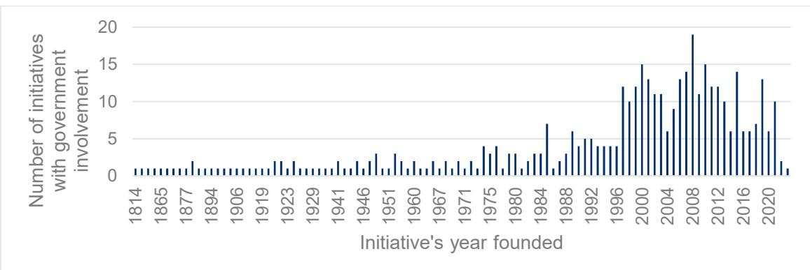
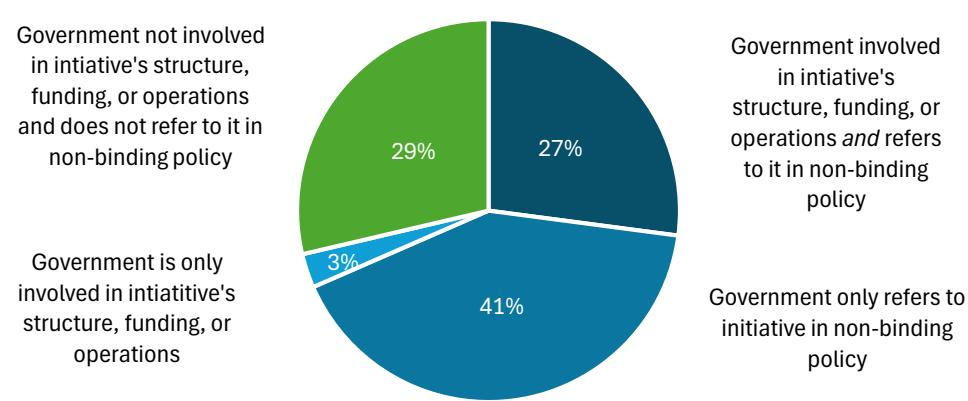

# Government involvement in sustainability initiatives: An overview

31 July 2026

## Key messages

\- Governments are increasingly engaging with sustainability initiatives amid a rapidly expanding and complex landscape. Sustainability initiatives are multi-stakeholder, industry, or public schemes or programmes offering tools, guidance, requirements, or assessments that companies use as part of their responsible business conduct (RBC) due diligence, but which do not replace their own responsibilities.

\- Uncertainty regarding the scope, quality, and reliability of many initiatives can make it difficult for governments and policymakers to identify credible schemes and provide clarity on how they may support company compliance with legal and policy requirements.

\- Analysis of an OECD pilot database covering 1078 sustainability initiatives found that governments are not involved in the majority of initiatives' governance, funding, or operations. Only $30\%$ of initiatives involve government participation in at least one of these areas, while $70\%$ operate without government involvement.

\- Governments most commonly engage with sustainability initiatives by referencing them in non-legally binding policies, guidance, or recommendations to support or clarify their use. This applies to 71% of initiatives. Formal recognition of initiatives in legislation as a means of demonstrating compliance is less widespread.

\- Governments also consider sustainability initiatives as part of their decision making processes, including public procurement and trade or investment policy. However, there is currently no systematic data on the prevalence of such practices.

\- Sustainability initiatives are an important component of the broader policy toolkit for advancing RBC. Governments can draw on a range of engagement approaches depending on their policy objectives. Regardless of the form of engagement, governments should assess the credibility, scope, and effectiveness of initiatives before endorsing, recognising, or relying on them in decision making. They are also well positioned to support further analysis of how government involvement influences the quality, effectiveness, and uptake of sustainability initiatives.

## Box 1. About this brief

This policy brief provides a preliminary analysis of government involvement in sustainability initiatives. Its main contribution is a categorisation of the different ways governments engage with initiatives, whether through their governance, funding or operations, or through the wider policy ecosystem.

The analysis draws on an OECD pilot database of 1 078 sustainability initiatives identified through an AI-assisted methodology reviewing sustainability disclosures by the 500 largest listed companies between 2020 and 2025. The brief uses this dataset to categorise types of government involvement in the initiatives referenced by these companies.

This is a preliminary exercise rather than a comprehensive mapping. The findings are based on early results from a pilot methodology and may be refined as the dataset is further developed. Additionally, because governments can engage with initiatives through a wide range of policy instruments (from legally to non-legally binding) and policy areas (including trade, investment and public procurement), the brief does not attempt to quantify the full extent of engagement through this wider policy ecosystem. Instead, it uses practical examples to illustrate the range of government approaches across these areas.

Future research could build on the categorisation set out in this brief in several directions: assessing the credibility and alignment of initiatives with due diligence standards, including through the OECD's forthcoming Fitness Framework for sustainability initiatives supporting due diligence; examining more closely how and why governments reference initiatives in non-binding policy, and the characteristics of the initiatives they choose to reference; and comparing whether some forms of government engagement are more effective than others in advancing policy objectives.

## The involvement of government in sustainability initiatives

Sustainability initiatives have steadily emerged as companies and governments seek to give consumers and investors greater clarity and confidence regarding the sustainability of products, companies, supply chains, and investments (OECD, 2022[1]). From prominent initiatives like Green Button to the Forest Stewardship Council, a wide variety of sustainability initiatives are arising to help address these concerns. Sustainability initiatives are any multi-stakeholder, government-backed or industry initiative, scheme or programme that provides tools, information, capacity building or otherwise facilitates, sets requirements for, or monitors, audits, verifies, assures, certifies, benchmarks or otherwise assesses business practices, sites or products in relation to sustainability objectives (i.e. objectives related to human rights, social or environmental impacts) (OECD, 2022[1]; OECD/ITC, 2024[2]). Sustainability requirements can also include requirements on due diligence processes or RBC issue areas, as well as provide policies, guidance, and tools to help businesses manage sustainability risks and impacts (OECD/ITC, 2024[2]). For companies, sustainability initiatives can provide knowledge and resources to help manage supply chain risks and pool knowledge to reduce costs and improve efficiency of conducting due diligence.

In the context of RBC due diligence, the objectives of sustainability initiatives can fall into two broad categories: facilitation initiatives and verification initiatives (OECD, 2022[1]).

Facilitation initiatives refer to initiatives that facilitate or inform companies' risk management and broader due diligence responsibilities, but do not monitor, assess, assure, verify or certify company performance (OECD, 2022[1]). They may, for example, provide information, tools and guidance, or set targets for companies.

Verification initiatives refer to initiatives that set written requirements for companies or products and monitor, assess, verify, certify, assure or benchmark companies, sites, products, suppliers or other business partners against those requirements (OECD, 2022[1]).

Many initiatives blend a combination of facilitation and verification activities. This policy brief analyses both facilitation and verification initiatives, as well as initiatives that support both roles.

For RBC, policymakers have identified sustainability initiatives as an important tool in the mix of policy options to help companies meet evolving requirements. Governments are engaging with sustainability initiatives to help evaluate, recognise, and incentivise good business practices against specific standards and to foster collaboration between relevant actors (OECD/ITC, 2024[2]). Recent years have seen an increasing number of sustainability initiatives with governments at the helm or playing a more prominent role (see Figure 2 below).

## What are the opportunities and challenges for governments in leveraging sustainability initiatives for RBC?

As sustainability initiatives continue to emerge across geographies, sectors, and commodities, the landscape becomes more complex (OECD, 2025[3]). Although a comprehensive data set of sustainability initiatives does not exist, an OECD pilot study used an AI-assisted methodology to map sustainability initiatives. The study drew on sustainability disclosures by the 500 largest listed companies (2020-2025), identifying 1078 individual sustainability initiatives (OECD, 2026[4]). Companies frequently reference different initiatives in their disclosures – with some companies citing nearly 100 initiatives. Individual initiatives command a substantial share of a market: for instance, cross-sectoral initiatives such as the Forest Stewardship Council are referenced by firms representing $50\%$ of the market capitalisation of the top 500 companies (OECD, 2026[4]). As sustainability initiatives have grown in number and reach, previous research has also highlighted the extent of government involvement in initiatives. For instance, a 2017 MSI Integrity study on 45 multi-stakeholder initiatives found that they operated in over 170 countries and engaged over 50 governments (OECD, 2022[1]).

When well-designed, sustainability initiatives can support the implementation of due diligence responsibilities, whether that is through the evaluation of RBC performance based upon rigorous criteria, or platforms that convene and exchange upon good practices. Yet, OECD alignment assessments since 2016 indicate that sustainability initiatives differ significantly in scope, focus, quality and effectiveness, and in how far they integrate due diligence consistent with international standards (OECD, 2022[1]). Governments can thus face a lack of clarity when identifying and leveraging credible initiatives to recommend to businesses or to use in their own decision making.

Sustainability initiatives operate within a broader governance ecosystem where international, regional, or national legal instruments on sustainability share the same goal of promoting sustainable development along value chains (OECD/ITC, 2024[2]). Governments have a role to play as policymakers to provide flexibility for companies to use sustainability initiatives to support their implementation of RBC due diligence expectations. Beyond this, governments can help improve the quality and standardisation of initiatives operating in their jurisdictions through consistent policy and guidance. Strengthening the credibility of sustainability initiatives can help ensure that companies are meeting national expectations on RBC. A company's use of sustainability initiatives can also inform government decision making in areas such as public procurement, trade, and investment. At the same time, sustainability initiatives are only one possible tool to promote sustainability and RBC, and that can be applied alongside other approaches (OECD, n.d.[5]). Despite the clear link between governments and sustainability initiatives, there has been no systematic analysis of the different ways that governments interact with sustainability initiatives.

## How are governments interacting with sustainability initiatives?

To date, governments have been engaging with sustainability initiatives for various purposes. OECD research has identified numerous ways that governments are involved in sustainability initiatives:

\- Government ownership or creation. Government is the legal owner, founder or mandating authority of a sustainability initiative. For example, the German Federal Ministry for Economic Co-operation and Development (BMZ) created the Green Button certification label for sustainable textiles, which uses independent third-party assessment to evaluate whether companies take responsibility for respecting human rights and environmental standards in their supply chains (Green Button, n.d.[6]).

\- Government commissioned or convened. Government has initiated, substantially structured, or funded the initiative without retaining formal ownership. Day-to-day operations and governance may be shared. Electronics Watch, for instance, emerged from an EU-funded initiative with the goal of bringing together public buyers to promote and protect workers' rights in global supply chains. The governance is shared between public buyers, experts in human rights, labour rights, trade union rights, environmental rights, occupational health and safety, and global supply chains, as well as representatives from CSOs and trade unions (Electronics Watch, n.d.[7]).

\- Government participation in governance. A government entity holds a formal seat in the initiative's governance, as a board member, observer or advisory committee participant. The Extractives Industries Transparency Initiative is a multi-stakeholder organisation created to promote information disclosure along the extractive industry value chain which includes governments in its board. The EITI Board consists of 20 representatives from implementing countries, supporting countries, CSOs, industry, and institutional investors (EITI, n.d.[8]).

Governments also interact through the wider policy ecosystem that the initiatives operate in:

\- Formal legislative or regulatory recognition. Government has formally recognised the initiative as a tool through which companies can meet legal requirements. One example is the recognition of the Responsible Minerals Initiative (RMI) by the European Commission for Conflict Minerals Regulation compliance (see Box 3).

\- Reference in non-legally binding policy instruments. Government references the initiative in guidance, policy frameworks, or voluntary tools without creating a legal compliance function. The purpose may be to endorse or recommend an initiative, or to simply signal the initiative as one possible tool to support business in meeting sustainability expectations. For instance, the Government of Canada developed guidance on how sustainability initiatives in the forestry sector, such as the Forest Stewardship Council, fit into the national legal context on forestry (see Box 2).

\- Informing government decision making. Government considers a company's participation in or certification by a sustainability initiative when conducting their own activities (such as public procurement, trade, and investment). Governments can also promote the use of an initiative to help achieve a policy target (i.e. setting a threshold for percentage of companies with a certification or conformity assessment as part of a policy objective aiming to promote uptake of RBC). The ENERGY STAR certification used by US Government agencies in public procurements is one relevant example of this type of practice (see Box 4).

The analysis presented in this paper on how governments engage with and in sustainability initiatives is based on the OECD pilot study on 1078 unique sustainability initiatives. The mapping covered both facilitation and verification initiatives. It is not a comprehensive mapping of all sustainability initiatives, but features many initiatives currently being used by companies. The dataset is derived from initiatives referenced in company disclosures between 2020 and 2025; in the future, the dataset may be further developed and refined. The analysis presented in this policy brief builds upon the OECD pilot study by looking at the involvement of government in the initiatives in the baseline dataset. It seeks to provide initial insights into how governments are engaging with sustainability initiatives, but does not examine the effects of government involvement.

While governments engage in the governance, funding, or operations of sustainability initiatives, most initiatives still operate independently of government involvement

A preliminary analysis of 1078 initiatives in the OECD's pilot database found that governments owned or created; commissioned or convened; or participated in 323 initiatives (30% of initiatives from the pilot database). Many of these initiatives included several types of government involvement – for instance, a government commissioning an initiative as well as participating in its governance. On the other hand, 755 initiatives did not include government involvement (70% of initiatives from the pilot database)(see Figure 1).

## Figure 1. Most sustainability initiatives operate without government involvement

Share of sustainability initiatives that involve government in their structure, funding or operations  
  
Note: An initiative was counted if the research revealed at least one type of these types of involvement: government owned or created, government commissioned or convened, or government participation in governance.
Source: OECD analysis of pilot database on sustainability initiatives.

Further analysis demonstrates that the number of initiatives in recent years increased – as does the number of initiatives involving government. The majority of initiatives do not include government involvement, and many initiatives without government involvement are established each year.

Figure 2. Government involvement in initiatives has increased over time  
Number of sustainability initiatives created with government involvement in their structure, funding, or operations  
  
Source: OECD analysis of pilot database on sustainability initiatives.

## Governments frequently reference sustainability initiatives in non-binding policy

Aside from direct involvement in the sustainability initiative (by owning or creating; commissioning or convening; and participating in), governments interact with the initiatives through their policies, for example by referencing initiatives or by allowing companies to demonstrate compliance with policy goals through sustainability initiatives. The OECD analysis of the pilot database revealed that references to sustainability initiatives (both verification and facilitation initiatives) in non-binding policy instruments are frequent: 71% of the sustainability initiatives were mentioned in government policies, guidances, and policy dialogues around sustainable supply chains. This share may be higher in reality, as the preliminary analysis was primarily centred on publicly available government documents in English, and additional policies could exist with references to initiatives in other languages that present research was unable to cover.

Of the 71% of sustainability initiatives that government references in non-binding policy, almost half are cases where the government is both involved in the governance, funding, or operations of an initiative and refers to it in non-binding policy (see Figure 3). This demonstrates how some governments are supporting initiatives structurally as well as promoting their use, or how governments are using their own policy frameworks to promote initiatives they have established themselves. In fact, only 3% of initiatives are not referenced in policy when the government is a part of its structure, funding, or operations – supporting a preliminary finding that governments participating in an initiative are more likely to promote it. However, governments are still citing initiatives they are not involved in structurally. More than a quarter of initiatives do not involve any government interaction. Figure 3 demonstrates this breakdown.

## Figure 3. Governments adopt different approaches to engaging with sustainability initiatives

Share of sustainability initiatives with government involvement and / or references in non-binding policy

  
Source: OECD analysis of pilot database on sustainability initiatives.

Across countries, sustainability initiatives feature in non-binding policy instruments representing a variety of sectors, supply chains, or commodities. Often, governments reference initiatives that are particularly relevant for the country context – for instance, covering a prominent industry or commodity. provides an example of a government highlighting how a sustainability initiative fits into the national legal context and relevant standards on forestry.

## Box 2. Forest Stewardship Council features in Canadian Government guidance and policy

The Canadian National Council for Air and Stream Improvement published a guidance document to navigate the complex and evolving Canadian forestry regulations and standards. Along with the relevant legislation and regulation, the guidance highlights three sustainable forest management certifications, including the Forest Stewardship Council (FSC) which is applied to over 48 million hectares of land in Canada (NCASI, 2022[9]). The guidance highlights the voluntary nature of the certifications, which can supplement measures that address regulatory requirements at the federal and provincial levels (NCASI, 2022[9]). It also provides information on what the FSC is and its main principles.

The FSC, founded in 1994, sets the standard for responsible forest stewardship to support healthy ecosystems and help protect the rights of workers, Indigenous Peoples, and local communities (FSC, n.d.[10]). According to the Canada Council of Forest Ministers, the FSC sets high thresholds that forest companies must comply with, provides a stamp of approval for customers showing products originating from their forests meet high standards, has a thorough auditing process to issue certifications, and is tailored to consider global forestry issues as well as the local Canadian context (Government of Canada, 2025[11]).

Source: NCASI (2022[9]), Canadian Forestry Regulations and Standards, https://ncasi.org/wp-content/uploads/2019/02/NCASI18\_CanForestReg\_2021rev1\_web.pdf.

FSC (n.d.[10]), About us, https://fsc.org/en/about-us.

Government of Canada (2025[11]), Forest management certification in Canada, https://natural-resources.canada.ca/forests-forestry/sustainable-forest-management/forest-management-certification-canada.

## Governments formally recognise sustainability initiatives in legislation

Another way that governments provide (more formal) recognition of a verification initiative is through references in legislation. This includes mentioning an initiative as a tool to help support compliance or declaring their equivalence when complying with legal obligations. Given the stringent process that governments typically take to assess sustainability initiatives for equivalence, this is not currently a prevalent practice, but rather one possible option for governments in the smart mix (see Box 3 below).

A concern around formal recognition in legislation is the risk of creating safe harbours from liability for companies who participate in an initiative (OECD, 2022[1]). Participating in an initiative, even one well-aligned and credible, is not a guarantee of the responsible conduct of a company (OECD, 2022[1]). The OECD's analysis of the initiatives in the pilot database revealed that just over $15\%$ of initiatives had legislative or regulatory recognition, but not all of these initiatives were determined as equivalent for compliance (i.e. an initiative could be recommended through the legislation as a tool). Box 3 provides an example of a regulation formally recognising a sustainability initiative through an assessment process.

## Box 3. The Responsible Minerals Initiative (RMI) is recognised by the European Commission for Conflict Minerals Regulation Compliance

The Conflict Minerals Regulation (CMR), passed in 2017 with its core due diligence obligations applying from 2021, aims to stop imports of conflict minerals and metals and to ensure that global and EU smelters and refiners source tin, tantalum, tungsten and gold (3TG) responsibly (European Commission, 2017[12]; Regulation (EU) 2017/821, 2017[13]). The regulation requires EU-based importers to source 3TG from responsible sources only, conducting risk-based due diligence in line with the OECD's Due Diligence Guidance for Responsible Supply Chains of Minerals from Conflict-Affected and High-Risk Areas (OECD, 2016[14]). Under Article 8 of the Regulation, sustainability initiatives may apply to the Commission for recognition (Regulation (EU) 2017/821, 2017[13]). The Commission assesses applications from sustainability initiatives under Commission Delegated Regulation (EU) 2019/429, whose criteria are closely aligned with the OECD Alignment Assessment (OECD, 2024[15]) to evaluate sustainability initiatives. Recognised initiatives can help importers comply with CMR requirements by providing independent third-party assurance. EU importers sourcing exclusively from smelters and refiners listed as conformant with a recognised sustainability initiative are exempted from carrying out their own third-party audit. Their other due diligence obligations, such as risk management, information-sharing with downstream purchasers, and public reporting, still apply.

The RMI, through its Responsible Minerals Assurance Process (RMAP), is the first sustainability initiative to be officially recognised by the EC under the CMR. In 2025, the EC found that the RMI's RMAP standards for 3TG are “fully aligned” with the requirements of the CMR, using an OECD-informed assessment approach (Commission Implementing Decision (EU) 2025/2071, 2025[16]; RMI, 2025[17]).

Source: European Commission (2017[12]), Conflict Minerals Regulation, https://policy.trade.ec.europa.eu/development-and-sustainability/conflict-minerals-regulation\_en.

Regulation (EU) 2017/821 (2017[13]), Regulation (EU) 2017/821 of the European Parliament and of the Council of 17 May 2017 laying down supply chain due diligence obligations for Union importers of tin, tantalum and tungsten, their ores, and gold originating from conflict-affected and high-risk areas, https://eur-lex.europa.eu/eli/reg/2017/821/oj/eng.

Commission Implementing Decision (EU) 2025/71 (2025[16]), Commission Implementing Decision (EU) 2025/71 of 16 October 2025 on the recognition of equivalence under Article 8(3) of Regulation (EU) 2017/821 of the European Parliament and of the Council of the supply chain due diligence scheme Responsible Minerals Assurance Process owned by the Responsible Minerals Initiative, https://eur-lex.europa.eu/legal-content/EN/TXT/?uri=OJ:L\_202502071.

RMI (2025[17]), RMI RMAP is First Scheme Recognised by European Commission for Conflict Minerals Regulation Compliance, https://www.responsiblemineralsinitiative.org/news/rmap-cmr/.

OECD (2016[14]), OECD Due Diligence Guidance for Responsible Supply Chains of Minerals from Conflict-Affected and High-Risk Areas, https://www.oecd.org/en/publications/2016/04/oecd-due-diligence-guidance-for-responsible-supply-chains-of-minerals-from-conflict-affected-and-high-risk-areas\_g1g65996.html.

OECD (2024[15]), Methodology for OECD alignment assessments of sustainability initiatives, https://www.oecd.org/en/publications/methodology-for-oecd-alignment-assessments-of-sustainability-initiatives\_b533c060-en.html

## Governments consider sustainability initiatives in their own decision making processes

Like businesses, governments interact with the market through their own economic and commercial activities, and are increasingly using sustainability initiatives to inform their decision making. OECD analysis of the pilot database did not systematically analyse the use of the sustainability initiatives in government decision making. Data is limited on governments considering sustainability initiatives in public procurement, trade, and investment, but there are practical examples. For instance, in public procurement, governments include a certification as criterion in tender processes, e.g. setting specifications or a standard for a good or service through certifications. This allows public procurers to leverage sustainability criteria and assessment methods developed by certification schemes (One Planet Network, 2025[18]). For instance, Korea's Act on the Promotion of Purchase of Green Products requires state agencies to purchase products for which ecolabels exist, covering 158 product categories. Ecolabelling under Korea's system involves third-party testing and certification against defined environmental criteria (One Planet Network, 2025 $^{[18]}$ ).

Governments consider conformity assessments or certifications when pursuing policy goals on public procurement, such as setting a target threshold for the use of certifications. The OECD's 2022 Survey on Green Public Procurement shows that countries assist buyers through guidance on how to integrate certifications and other green procurement criteria in public tenders (OECD, 2024[19]). The UN Environment Programme's 2022 Sustainable Public Procurement Global Review found that $45\%$ of surveyed organisations used ecolabels as a reference tool to create criteria, and $39\%$ used the ecolabel's third-party verification to confirm that a product met purchasing criteria (Global Ecolabelling Network, 2023[20]). However, this data is not disaggregated for governments. An example, on public procurement, features in Box 4.

## Box 4. ENERGY STAR used by US Government agencies in public procurements

Created by the US Environmental Protection Agency in 1992, ENERGY STAR is a government-backed labelling programme that identifies energy-efficient products, buildings, and equipment meeting specified performance standards (ENERGY STAR, n.d. $^{[21]}$ ). The label is widely used across product categories including computers, lighting, appliances, heating and ventilation systems, and office equipment, providing independently verified evidence of reduced energy consumption and lower lifecycle operating costs.

US federal procurement law requires purchasing ENERGY STAR-certified products in many categories (ENERGY STAR, n.d.[22]). The Energy Policy Act of 2005 mandates that federal agencies procure ENERGY STAR-qualified or Federal Energy Management Program (FEMP)-designated products unless no compliant product is reasonably available or cost-effective (United States Government, 2005[23]; ENERGY STAR, n.d.[22]). The Federal Acquisition Regulation instructs contracting authorities to include energy-efficiency requirements in federal contracts (United States Government, 2019[24]).

Source: ENERGY STAR (n.d.[22]), Federal Procurement Policies for Energy-Saving Products, https://www.energystar.gov/products/federal\_procurement\_policies\_energy\_star\_certified\_products.
ENERGY STAR (n.d.[24]). About ENERGY STAR, https://www.energystar.gov/about?s=mega

ENERGY STAR (n.d.[21]), About ENERGY STAR, https://www.energystar.gov/about?s=mega.

United States Government (2005[23]), PUBLIC LAW 109-58-AUG. 8, 2005, Energy Policy Act of 2005, https://www.congress.gov/109/plaws/publ58/PLAW-109publ58.pdf.

United States Government (2019[24]), Federal Acquisition Regulation, https://www.acquisition.gov/browse/index/far

Similarly, government financing decisions consider whether businesses hold specific certifications or participate in recognised sustainability initiatives. A report by Impact Finance Belgium, an association of capital providers, spotlights labels and certifications used in the sustainable and impact finance sector, several of which apply third-party assessment while others rely on self-reporting (Impact Finance Belgium, 2024[25]). In the context of development co-operation, governments support the work of sustainability initiatives in developing countries. For example, the Swiss-funded programme, Transparency and Innovation of Sustainability Standards, intends to support voluntary sustainability standards, including by strengthening the effectiveness of certifications (SECO, 2024[26]).

In trade, governments enact policies that require or recommend sustainability initiatives they view as integrating international standards. In Italy, contracting authorities integrated Fair Trade criteria as part of the core requirements (Fair Trade, 2021[27]). Governments also promote the use of sustainability initiatives to achieve sustainability criteria in free trade agreements. The 2018 free trade agreement between Indonesia and the European Free Trade Association underwent a referendum in Switzerland in 2021 regarding the export of palm oil. Switzerland made concessions contingent on sustainability criteria set out in the agreement. Switzerland accepts four sustainability standards as proof of compliance. $^{1}$

European Commission (2017), Conflict Minerals Regulation, [12] https://policy.trade.ec.europa.eu/development-and-sustainability/conflict-minerals-regulation\_en.

## What can policymakers do?

\- Sustainability initiatives are one element of a broader smart mix of policy approaches to enable responsible business conduct, alongside other government measures such as capacity building, guidance, and enforcement.

\- Governments should select the mode of engagement with sustainability initiatives that best aligns with their context and policy objectives, and clearly communicate to companies how these initiatives interact with national legal obligations.

\- Before formally endorsing, recognising, or using sustainability initiatives in decision making, governments should assess their credibility, scope, and whether it is fit for purpose. The OECD's suite of tools, including alignment assessments, the OECD-ITC Typology, and forthcoming fitness framework can help governments but also importantly companies evaluate whether a sustainability initiative can credibly support due diligence.

\- Governments should engage with sustainability initiatives in ways that reinforce, rather than replace, companies' due diligence responsibilities. Where initiatives are referenced or recognised in legislation or policy, governments should make clear to companies that their participation does not in itself constitute compliance with due diligence obligations.

\- Governments involved in the governance, funding, or operations of sustainability initiatives are well-placed to assess the impacts of their involvement, including on initiative quality and uptake. This evidence can help inform future policy decisions on when and how government engagement with sustainability initiatives is most effective.

## References

Commission Implementing Decision (EU) 2025/2071 (2025), Commission Implementing Decision (EU) 2025/2071 of 16 October 2025 on the recognition of equivalence under Article 8(3) of Regulation (EU) 2017/821 of the European Parliament and of the Council of the supply chain due diligence scheme Responsible Minerals, https://eur-lex.europa.eu/legal-content/EN/TXT/?uri=OJ:L\_202502071.

EITI (n.d.), EITI Board, https://eiti.org/eiti-board. [8]

Electronics Watch (n.d.), Governance, https://electronicswatch.org/en/governance\_1385. [7]

ENERGY STAR (n.d.), About ENERGY STAR, https://www.energystar.gov/about?s=mega. [21]

ENERGY STAR (n.d.), Federal Procurement Policies for Energy-Saving Products, [22] https://www.energystar.gov/products/federal\_procurement\_policies\_energy\_star\_certified\_products.

Fair Trade (2021), Public Policies on Fair Trade, https://www.fairtrade.net/content/dam/fairtrade/fairtrade-international/library/2021/public-policies-on-fair-trade/Fair-Trade-public-policies-report-EN-Apr2022.pdf. [27]

FSC (n.d.), About us, https://fsc.org/en/about-us.

Global Ecolabelling Network (2023), Global assessment of ecolabels – Findings from the 2022 Sustainable Public Procurement Global Review, https://globalecolabelling.net/2023/03/23/global-assessment-of-ecolabels-findings-from-the-2022-sustainable-public-procurement-global-review/. [20]

Government of Canada (2025), Forest management certification in Canada, https://natural-resources.canada.ca/forests-forestry/sustainable-forest-management/forest-management-certification-canada.

Green Button (n.d.), Green Button, https://gruener-knopf.de/en.

Impact Finance Belgium (2024), Overview of the Labels and Certificates in Sustainable and Impact Finance, https://impactfinance.be/wp-content/uploads/2024/04/240412\_Labels-and-Certificates-Report.pdf.

NCASI (2022), Canadian Forestry Regulations and Standards, https://ncasi.org/wp-content/uploads/2019/02/NCASI18\_CanForestReg\_2021rev1\_web.pdf.

OECD (2026), OECD Responsible Business Outlook 2026: Making Commitments Count, OECD Publishing, Paris, https://doi.org/10.1787/2b15370f-en.

OECD (2025), Sustainability initiatives in due diligence regulation and policy, OECD Publishing, Paris, https://doi.org/10.1787/eafa3786-en. [3]

OECD (2024), Harnessing Public Procurement for the Green Transition: Good Practices in OECD Countries, OECD Public Governance Reviews, OECD Publishing, Paris, https://doi.org/10.1787/e551f448-en.

OECD (2024), Methodology for OECD alignment assessments of sustainability initiatives, OECD Publishing, Paris, https://doi.org/10.1787/b533c060-en.

OECD (2022), The role of sustainability initiatives in mandatory due diligence: Background note on Regulatory Developments concerning Due Diligence for Responsible Business Conduct, OECD Publishing, Paris, https://www.oecd.org/content/dam/oecd/en/topics/policy-sub-issues/due-diligence-guidance-for-responsible-business-conduct/the-role-of-sustainability-initiatives-in-mandatory-due-diligence-note-for-policy-makers.pdf.

OECD (2016), OECD Due Diligence Guidance for Responsible Supply Chains of Minerals from Conflict-Affected and High-Risk Areas: Third Edition, OECD Publishing, Paris, https://doi.org/10.1787/9789264252479-en.

OECD (n.d.), OECD Business and Finance Policy Papers, OECD Publishing, Paris, https://doi.org/10.1787/bf84ff64-en.

OECD/ITC (2024), Understanding Sustainability Initiatives: A Typology Framework, OECD Publishing, Paris, https://doi.org/10.1787/8f8a3d7f-en. [2]

One Planet Network (2025), Good practice on ecolabels and sustainable public procurement: Sustainable public procurement policies, ecolabels and environmental certifications, https://www.oneplanetnetwork.org/knowledge-centre/resources/good-practice-ecolabels-and-sustainable-public-procurement-sustainable.

Regulation (EU) 2017/821 (2017), Regulation (EU) 2017/821 of the European Parliament and of the Council of 17 May 2017 laying down supply chain due diligence obligations for Union importers of tin, tantalum and tungsten, their ores, and gold originating from conflict-affected and high-ri, https://eur-lex.europa.eu/eli/reg/2017/821/oj/eng.

[24]

RMI (2025), RMI RMAP is First Scheme Recognized by European Commission for Conflict Minerals Regulation Compliance, https://www.responsiblemineralsinitiative.org/news/rmap-cmr/.

SECO (2024), Transparency and Innovation of Sustainability Standards (TISS) Phase II, https://www.seco-cooperation.admin.ch/dam/en/sd-web/IIIUziKxFASF/factsheet-transparency-and-innovation-of-sustainability-standards-tiss.pdf.

United States Government (2019), Federal Acquisition Regulation, https://www.acquisition.gov/browse/index/far.

United States Government (2005), Energy Policy Act of 2005, https://www.congress.gov/109/plaws/publ58/PLAW-109publ58.pdf.

[23]

## Notes

$^{1}$ Roundtable on Sustainable Palm Oil's “Identity Preserved” and “Segregated”; International Sustainability and Carbon Certification PLUS Segregated; and Palm Oil Innovation Group.

## Contact

## RBC@OECD.org

This work is issued under the responsibility of the Secretary-General of the OECD, and does not necessarily reflect the official views of OECD Member countries.

This document was produced with the financial assistance of the European Union. The views expressed herein can in no way be taken to reflect the official opinion of the European Union.

This document, as well as any data and map included herein, are without prejudice to the status of or sovereignty over any territory, to the delimitation of international frontiers and boundaries and to the name of any territory, city or area.

© OECD 2026

## Attribution 4.0 International (CC BY 4.0)

This work is made available under the Creative Commons Attribution 4.0 International licence. By using this work, you accept to be bound by the terms of this licence (https://creativecommons.org/licenses/by/4.0/).

Attribution – you must cite the work.

Translations – you must cite the original work, identify changes to the original and add the following text: In the event of any discrepancy between the original work and the translation, only the text of original work should be considered valid.

Adaptations – you must cite the original work and add the following text: This is an adaptation of an original work by the OECD. The opinions expressed and arguments employed in this adaptation should not be reported as representing the official views of the OECD or of its Member countries.

Third-party material – the licence does not apply to third-party material in the work. If using such material, you are responsible for obtaining permission from the third party and for any claims of infringement.

You must not use the OECD logo, visual identity or cover image without express permission or suggest the OECD endorses your use of the work.

Any dispute arising under this licence shall be settled by arbitration in accordance with the Permanent Court of Arbitration (PCA) Arbitration Rules 2012. The seat of arbitration shall be Paris (France). The number of arbitrators shall be one.