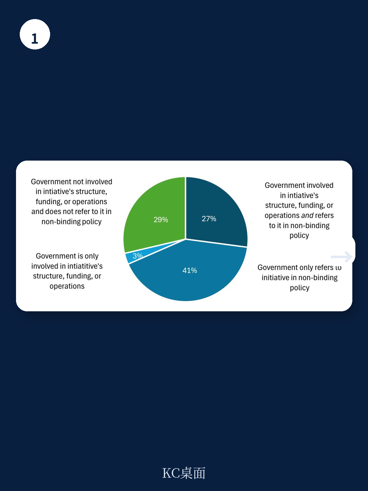
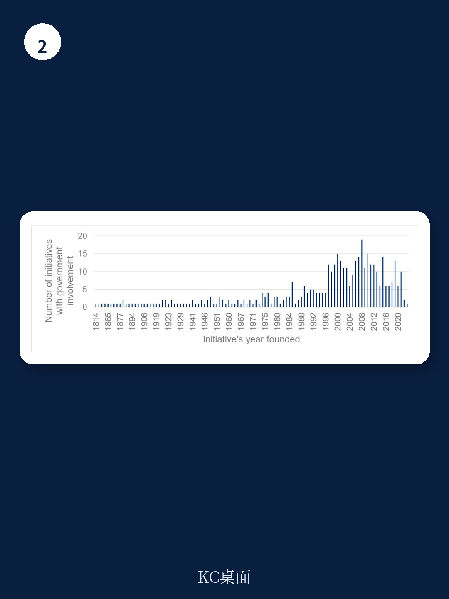

# 经合组织：区域环境与行业变化观察

可持续倡议正在成为企业尽责管理（RBC）的重要工具，但政府在其中扮演的角色一直缺乏系统梳理。经合组织2026年7月发布的一份政策简报，基于对1078项可持续倡议的试点数据库分析，给出了一个此前未被量化的判断：多数倡议的治理、资金和运营并不依赖政府，政府参与更多发生在政策引用层面，而非结构性介入。

这份简报的独特之处在于，它首次将政府参与方式拆分为结构性参与（拥有、委托或参与治理）和政策生态参与（立法认可、非约束性政策引用、影响政府决策）两个层面。数据显示，仅30%的倡议存在至少一种结构性政府参与，而71%的倡议被政府在非约束性政策文件中提及。两组数字放在一起，勾勒出政府与可持续倡议之间一种“轻介入、重引用”的关系。

## 1. 结构性参与占比三成，多数倡议独立运作

经合组织试点数据库覆盖了2020至2025年间全球500家最大上市公司披露中提及的1078项可持续倡议。分析显示，政府拥有、委托或参与治理的倡议共323项，占30%；其余755项倡议在结构、资金和运营层面均无政府介入。

值得注意的是，近年新设立的倡议数量在增加，涉及政府参与的倡议数量也在上升，但无政府参与的倡议仍占每年新增的大多数。这意味着可持续倡议的扩张主要依靠市场力量和企业需求驱动，政府在其中更多是跟随者而非发起者。

> **KC评论：** 三成这个比例本身比高低更重要。它说明可持续倡议的供给端高度分散，企业面对的是一个由非政府主体主导的工具市场，政府的背书能力因此成为稀缺资源。

## 2. 非约束性政策引用是政府介入的主要方式

政府与可持续倡议最普遍的互动方式，是在政策、指南和对话中引用这些倡议。经合组织分析发现，71%的倡议被至少一份政府非约束性政策文件提及。这一比例可能被低估，因为初步分析主要基于英文公开文件，其他语言的政策引用未被完全覆盖。

在政府既结构性参与又政策引用的案例中，近半数呈现双重介入。反过来看，当政府参与倡议的结构、资金或运营时，仅3%的倡议未被政策引用。这支持了一个初步判断：政府一旦结构性介入某项倡议，就更倾向于通过政策框架推广其使用。与此同时，超过四分之一的倡议既无政府结构性参与，也无政策引用，完全游离于政府视野之外。

## 3. 立法认可仍属少数，采购与研究领域数据缺失

与政策引用形成对比的是，通过立法正式认可倡议作为合规工具的案例并不普遍。简报给出的典型例子是欧盟委员会在冲突矿产法规合规中认可负责任矿产倡议（RMI）的审计项目。这种正式认可赋予倡议法律效力，但门槛较高，适用范围有限。

政府还将可持续倡议纳入自身决策过程，包括公共采购、贸易和研究政策。美国联邦机构在采购中参考ENERGY STAR认证即属此类。但简报明确表示，目前缺乏关于这类实践普遍程度的系统性数据，只能通过具体案例说明政府介入方式的多样性。

> **KC评论：** 立法认可和政策引用之间的差距，反映的是政府背书强度的光谱。企业在选择可持续倡议时，可以据此判断某项认证或工具在监管层面的实际分量，而不只是看其市场知名度。

## 4. 政府介入前需评估倡议的可信度与有效性

简报指出，经合组织自2016年以来的对齐评估显示，可持续倡议在范围、重点、质量和有效性方面差异显著，对国际标准的整合程度也不一致。这意味着政府在选择提到或认可某项倡议之前，需要先评估其可信度、范围和有效性，否则可能将企业引向质量参差不齐的工具。

简报同时承认这是初步分析而非全面梳理。试点方法基于AI辅助识别企业披露中的倡议，数据库后续可能进一步细化；政府通过更广泛政策生态（如贸易、研究、采购）进行的介入，也未尝试量化。未来研究可沿三个方向推进：评估倡议与尽责管理标准的对齐程度、分析政府引用非约束性政策的具体动因、比较不同政府介入方式的有效性差异。

对企业和政策观察者而言，这份简报提供了一个可复用的分类框架：判断一项可持续倡议的政府关联度，先看结构性参与（拥有、委托、治理席位），再看政策生态参与（立法认可、政策引用、采购与研究决策），两个维度叠加才能还原政府介入的全貌。
