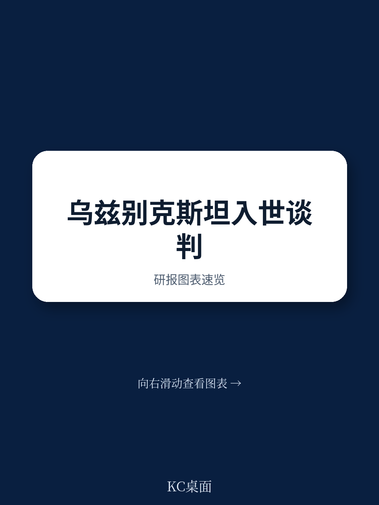

# 世界贸易组织：乌兹别克斯坦重申2026年入世目标

乌兹别克斯坦在2026年完成加入世界贸易组织进程的目标，正在从时间表变成可核验的谈判进度。该国政府代表在最新一次工作组会议上给出的信息是：书面问题数量持续下降、双边市场准入协议已签署31份、与WTO规则对齐的法律文件超过190项。这三个数字放在一起，指向一个明确判断——入世谈判已从广泛澄清阶段转入文本整合与剩余承诺磋商阶段。

这份陈述的价值不在于“进展顺利”的结论，而在于它提供了可追踪的节点。书面问题减少被乌方视为成员关切逐步解决的信号；法律对齐数量则展示了国内立法节奏。对关注中亚市场开放和贸易制度变迁的读者来说，这些节点比笼统的“谈判推进”更有参考意义。

## 1. 双边市场准入谈判完成31份协议签署

双边市场准入是入世谈判中最耗时的轨道之一。乌兹别克斯坦目前签署的34份双边协议中，已有31份交存WTO秘书处，最近一份是与印度签署的协议。剩余未交存协议的数量和谈判对象，报告没有完全展开，但31/34的比例本身说明大部分市场准入要价已经落定。

这一进度与农业国内支持谈判的评估相互印证。乌方认为，凯恩斯集团成员会认同农业国内支持讨论已进入最后阶段，剩余问题有限且可以通过操作性方式解决。两个主要谈判轨道同时接近尾声，意味着整体谈判重心正在从“谈什么”转向“怎么写进文本”。

> **KC评论：** 双边协议交存比例是入世谈判中少有的硬指标。31/34这个数字比任何表态都更能说明谈判阶段，也提示后续关注点应转向剩余协议的签署时间和文本整合速度。

## 2. 国内立法对齐WTO规则的法律文件超过190项

立法对齐是入世谈判中工作量最大、最不容易被外部观察到的部分。乌兹别克斯坦自上次工作组会议以来，与WTO规则对齐的法律文件总数已超过190项。其中进展最集中的领域是SPS与食品安全：统一食品安全委员会已经建立，农场到餐桌全链条的不确定性控制措施开始引入，修订后的食品安全法草案已提交参议院。

反倾销、反补贴和保障措施三个领域的法律草案也完成了新一轮修订，上周已分发给成员审议。修订方向是提高条款的精确性和可预测性，回应成员此前提出的关切。法律文本的修订节奏与工作组报告草案的整合同步推进，说明技术层面的谈判基础正在收窄。

## 3. 工作组报告草案进入文本整合阶段

工作组报告是入世谈判的核心文件，其整合程度直接决定谈判何时收官。乌方表示，成员提交的评论和建议已在连续修订稿中得到考虑，文本正在逐步合并，尚未解决的问题也变得更加清晰。结合主席的支持，谈判焦点应转向剩余承诺措辞，寻找平衡且可操作的解决方案。

从流程上看，这一阶段意味着谈判性质发生变化：不再是广泛交换意见，而是逐条敲定承诺语言。乌方提出2026年完成入世进程的目标，与当前文本整合的节奏基本匹配。但剩余承诺措辞的谈判往往涉及具体部门的市场开放细节，这部分内容在公开陈述中没有展开。

> **KC评论：** 入世谈判最后阶段的核心工作从“说服”转向“措辞”。190项法律对齐和31份双边协议是已经完成的部分，真正决定2026年时间表能否兑现的，是剩余承诺语言能否在成员之间达成一致。

## 4. 谈判节奏与完成时间表形成对应关系

乌方在陈述中特别感谢工作组安排尽早开会，并明确提及维持这一节奏对2026年完成入世进程的重要性。这一表述将时间表与谈判节奏直接挂钩：书面问题减少、法律对齐推进、双边协议交存，每一项进展都在为最终文本整合腾出空间。

对观察者而言，乌兹别克斯坦入世进程提供了一个跟踪框架：书面问题数量反映成员关切的消化程度，双边协议交存比例反映市场准入谈判进度，法律对齐数量反映国内制度准备深度。三个指标同时观察，比单一维度的“谈判进展”判断更可靠。该机构报告没有给出具体时间表承诺之外的细节，但现有信息已足够建立后续跟踪的坐标。
