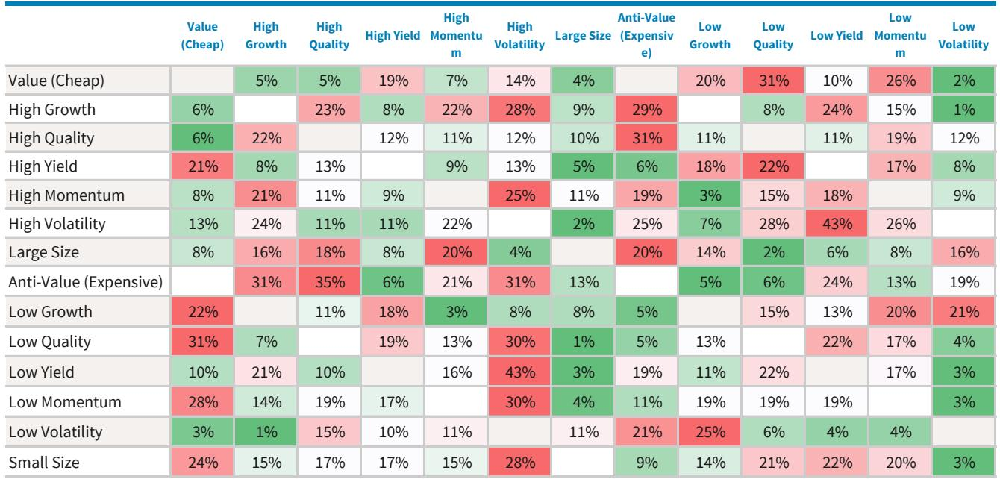

# 风险偏好回归并未解决美股的真正矛盾：增长的质量与可持续性

2026年5月，某外资投行发布了最新的全球权益因子月度观察。报告传递了一个清晰但容易被简化的信号：美国市场正在经历一场由强劲财报和地缘风险缓和共同推动的风险偏好回归，Growth（成长）与Momentum（动量）因子重获青睐，而此前在市场动荡中表现突出的Value（价值）与Quality（质量）因子则被下调评级。然而，这份报告真正的价值不在于告诉你“现在该买成长还是价值”，而在于揭示了一个更深层的判断：这轮反弹的结构性基础并不稳固，市场的定价正在偏离基本面中最关键的支撑——盈利增长的可持续性与运营杠杆的真实改善程度。

报告的核心洞察可以概括为一句话：市场正在为“风险偏好回归”定价，但尚未充分定价“增长质量的分化”和“能源尾部风险的反噬”。这决定了接下来几个月的因子轮动方向，也将考验投资者的仓位纪律。

## 1. 美国市场正在经历一场由财报驱动的“质量变局”，而非单纯的风险偏好切换

4月标普500指数上涨超过9%，Big Tech板块涨幅超过16%，Momentum因子单月回报达到18.6%。乍看之下，这是一轮典型的“风险回归”行情。但报告通过因子表现的结构性差异，揭示了一个更微妙的图景：这轮反弹并非所有资产的普涨，而是高度集中在少数几个“有故事可讲”的板块和因子中。

Growth因子在4月反弹5.1%，Momentum因子上涨7.0%，而与此同时，Quality因子几乎持平（仅下跌0.9%），延续了其自“解放日”危机以来持续走弱的态势。报告明确指出，Quality因子之所以被下调至Negative（负面），是因为“半导体、硬件和投机性AI敞口的风险偏好回归侵蚀了其防御吸引力，同时增长特征依然疲弱，估值偏高”。

这里的so what在于：市场正在将“盈利惊喜”与“增长质量”混为一谈。1Q26的EPS惊喜率高达18.0%，远超长期中位数的5.2%，Big Tech的EPS惊喜率更是达到惊人的40.7%。但这些数字背后，真正驱动回报的是估值重估，而非盈利的持续改善。报告中的图4清楚地展示了这一点：尽管NTM EPS增长强劲，但多个板块的估值倍数却在压缩，说明股价上涨主要依赖盈利上修，而非投资者愿意为未来支付更高溢价。这种“盈利驱动但估值收缩”的组合，恰恰是增长可持续性存疑的信号。

## 2. Big Tech的盈利惊喜正在掩盖一个关键分化：运营杠杆改善的广度不足

报告提供了1Q26盈利数据的详细分解，其中一组数字值得高度关注：标普500指数的EPS同比增长18.1%，但Sales（营收）同比增长仅为8.6%，这意味着净利润率同比扩张了1.2个百分点。从表面看，这确实意味着运营杠杆在改善——企业正在以更低的成本增长营收。

然而，当我们深入到因子层面，分化立刻显现。Big Tech的EPS同比增长27.7%，Sales增长25.6%，净利润率仅扩张0.5个百分点。这意味着Big Tech的盈利增长几乎完全由营收增长驱动，运营杠杆几乎没有贡献。而与之形成对比的是，标普500剔除科技后的样本，EPS增长9.4%，Sales增长4.9%，净利润率扩张0.5个百分点——运营杠杆贡献了接近一半的盈利增长。

更值得关注的是“TechX”（剔除Big Tech后的科技板块）的表现：EPS同比增长48.9%，Sales增长24.0%，净利润率扩张4.0个百分点。这才是真正的运营杠杆改善所在，但它的体量远小于Big Tech。

这里的含义是：市场对“AI驱动增长”的定价，实际上是在为Big Tech的营收增长和估值扩张买单，而非为全市场的运营效率提升买单。一旦Big Tech的营收增速放缓（比如由于基数效应或资本开支回报率下降），整个Growth因子的叙事基础就会受到动摇。

## 3. 美国市场对Value因子的降级，反映的是“反AI”风格的结构性困境，而非价值股本身的估值问题

报告将美国Value因子从Positive下调至Neutral，给出的理由包括：在风险偏好回归的市场中，其“防御性、反AI”的吸引力下降；长端利率上升仅提供部分支撑；消费者信心疲弱拖累其消费类敞口。

这个判断的深层逻辑在于：Value因子当前面临的不只是周期性问题，更是结构性问题。过去几个月Value的相对强势，很大程度上得益于地缘冲突驱动的能源股上涨。报告数据显示，能源板块在1Q26的EPS增长高达37.2%，但2Q26迄今已经下跌了9.9%。这意味着Value因子的“护城河”正在被侵蚀——它既不具备Growth因子的叙事吸引力，也失去了此前作为“地缘风险对冲”的战术价值。

更关键的是，报告指出Value因子与Momentum因子存在“结构性负相关”。当Momentum因子在高拥挤度下出现回调时，Value可能获得战术性反弹机会，但这种机会的持续性和幅度都存疑。对于投资者而言，这意味着“抄底价值”的策略需要建立在明确的催化剂之上，而不是基于简单的均值回归假设。

## 4. 欧洲市场的因子格局正在提供镜像：Value的盈利交付能力正在赶上Momentum的叙事优势

与美国市场形成有趣对照的是，欧洲市场的因子配置建议呈现出几乎相反的格局：欧洲Value为Positive，而Momentum为Neutral。报告给出的理由值得深思：欧洲Value的EPS增长已升至7%，为2023年1季度以来最高，盈利动量正在改善，且与Momentum存在结构性负相关。

这里的核心逻辑是：欧洲Momentum因子的拥挤度已经高到需要“管理敞口而非增加敞口”的程度，而Value因子则可能成为“Momentum之外最干净的受益者”。报告特别强调，Value是“任何从Momentum向外扩散”的最直接受益方。

这一判断对全球投资者的启示在于：因子轮动的驱动力正在从“叙事”转向“盈利交付”。欧洲Value的盈利改善并非来自估值修复的幻想，而是来自财报中超预期的EPS增长。如果这种趋势持续，欧洲Value因子的相对吸引力将不仅仅是战术性的，而可能演变为结构性的。

## 5. 报告尚未完全回答的关键问题：能源尾部风险如何影响因子轮动的节奏

报告在讨论美国市场展望时，埋下了一个重要的伏笔：当前美国股市的韧性，至少部分可以归因于“能源冲击距离现在只有五周而非八周”，因为冲突初期存在大量库存缓冲。但报告同时指出，市场对美联储的降息预期仅有一次（预计在2027年3月），叠加年内能源价格维持高位的预期以及原油和成品油库存缓冲的持续收缩，这些因素正在对风险资产构成“日益增长的中期阻力”。

这个判断意味着什么？如果能源价格在2H26重新走高，当前的风险偏好回归可能会遭遇逆风。届时，Growth和Momentum因子的相对吸引力将面临考验，而此前被市场抛弃的Yield和Quality因子可能会重获关注。

但报告对这一场景的讨论是有限的。它没有详细展开：如果能源冲击再次升级，哪些因子会最先承压？哪些因子会因“滞胀”逻辑而受益？Value因子在能源价格再次上涨时的表现会如何？这些问题的答案，需要结合更宏观的能源供需模型和通胀传导路径来推演。

## 6. 投资者需要建立的观察框架：从“买什么因子”转向“什么样的盈利交付值得溢价”

综合报告的全部信息，我们可以提炼出一个更有操作性的观察框架。当前的因子轮动，本质上是在回答一个问题：市场愿意为哪种类型的盈利增长支付溢价？

从报告的数据来看，答案正在发生微妙的变化。1Q26的财报季表明，市场对“盈利惊喜”的奖励是慷慨的——Big Tech的EPS惊喜率达到40.7%，远超长期中位数。但图5显示，所有四个季度的EPS预期都在被上修，这意味着“惊喜”正在被市场提前定价。当惊喜变成常态，定价权就会从“叙事”转移到“可持续性”。

因此，投资者应该关注以下三个信号：

第一，运营杠杆的改善是否从“少数板块”扩散到“全市场”。当前运营杠杆改善主要集中在TechX和部分工业板块，而Big Tech的运营杠杆贡献几乎为零。如果这一趋势延续，Growth因子的溢价将越来越依赖营收增速，而不是效率提升。

第二，能源价格的路径是否改变市场对利率的预期。报告已经暗示，能源库存缓冲的收缩可能在未来几个季度形成压力。如果油价再次突破关键阈值，市场对美联储降息的预期可能进一步推迟，这将直接压制长久期资产的估值。

第三，Momentum因子的拥挤度是否触发均值回归。欧洲市场已经提示了这一风险，美国市场的Momentum因子虽然尚未达到极端拥挤的水平，但其与Volatility因子的相关性正在上升，这通常是趋势反转的前兆。

这些信号不会同时出现，但任何一个信号的触发，都意味着当前的因子配置需要重新校准。而报告提供的最有价值的东西，不是具体的买卖建议，而是一套可以持续跟踪的因子“体检指标”。

---

上述分析中提到的能源尾部风险、运营杠杆扩散的广度、以及Momentum拥挤度的量化阈值，在完整报告中都有更详细的图表和回测数据作为支撑。这些内容超出了本文的讨论范围，但正是理解未来因子轮动方向的关键拼图。

加入社群，领取完整研报解读与原始图表。

*本文仅作学习交流，不构成任何投资建议。*
