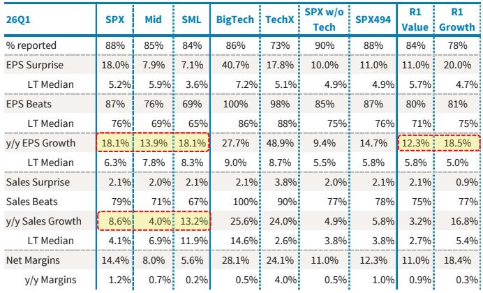

# The Risk-On Rotation Is Not a Pause — It Is a Regime Shift, and Most Factor Strategies Are Still Positioned for the Wrong Market

The most important signal from the April 2026 market data is not the 9% S&P 500 gain. It is the speed and conviction with which capital rotated out of defensive factor exposures and into growth, momentum, and high-volatility names. This was not a tactical bounce within a cautious market. It was a structural repricing driven by a convergence of earnings surprises, easing geopolitical fear, and a fundamental re-evaluation of which companies actually deliver earnings in this cycle.

The implication is blunt: the factor playbook that worked in the first quarter — heavy on quality, value, and yield — is now a liability. A global investment bank report from early May 2026 has explicitly upgraded Growth and Momentum to Positive, downgraded Quality to Negative, and moved Value to Neutral. These are not marginal adjustments. They represent a coordinated shift in the analytical framework that governs how billions in systematic and discretionary capital are allocated.

What makes this moment different from prior risk-on episodes is the underlying earnings foundation. The first-quarter 2026 earnings season delivered an 18% EPS surprise for the S&P 500, with Big Tech posting a stunning 40.7% surprise versus a long-term median of just 7.2%. This is not a market rallying on hope. It is a market rallying on delivered results. The question every investor must now answer is whether this earnings momentum is durable, and whether the defensive factors being discarded today will be repurchased at a discount or left behind entirely.

The report makes a compelling case that the regime is real. But it also leaves critical open questions about the sustainability of the energy shock buffer, the fragility of small-cap multiple expansion, and the timing of when quality becomes cheap enough to re-enter. This article unpacks the logic, exposes the tensions, and offers a decision framework for navigating the next phase.

## The Earnings Season Has Rewritten the Factor Hierarchy, and the New Peaks Are Growth and Momentum

The single most powerful data point in the report is the 40.7% EPS surprise for Big Tech in the first quarter. To put that in context, the long-term median surprise for this cohort is 7.2%. The actual result is nearly six times the historical norm. This is not a random quarter. It reflects a structural acceleration in earnings power driven by AI infrastructure spending, hyperscaler capex, and a broadening of technology demand beyond the consumer-facing names that dominated earlier cycles.

Growth factor performance in April was 11.9% for large-cap growth and 14.7% for small-cap growth, both significantly outpacing their value counterparts. Momentum surged 18.6% in a single month, a move that is three standard deviations above its 20-year average monthly sigma. These are not normal moves. They are signals that the market is repricing the earnings stream of a sUBSet of companies at a pace that overwhelms traditional valuation discipline.

The upgrade to Positive for both Growth and Momentum is therefore not a call on sentiment. It is a call on fundamentals. The report shows that Momentum currently delivers the strongest earnings profile across all factors, with next-twelve-months EPS growth above 100% year-to-date and forward earnings at the 93rd percentile versus history. When a factor's earnings trajectory is that extreme, the price action is not speculation — it is catching up to reality.

The downgrade of Quality to Negative is the mirror image of this logic. Quality's sales and earnings growth characteristics are historically subdued relative to other styles. In a market where the median earnings beat rate is 87% and the median EPS growth is 18.1%, Quality's defensive attributes become a drag, not a buffer. The report notes that despite recent price declines, Quality's valuations remain elevated. This is the worst possible combination: you are paying a premium for a factor that is delivering below-market growth and is out of favor with the marginal buyer.

## Value Is Not Cheap Enough to Be Interesting, and Its Consumer Exposure Is a Hidden Liability

The downgrade of Value to Neutral is one of the most consequential moves in the report, because Value had been a reliable haven during the Iran-related volatility earlier in the year. The report's rationale is clear: Value's defensive, anti-AI profile is less attractive in a risk-on market. Elevated long-end rates offer only partial support, while weak consumer sentiment weighs on Value's consumer-heavy exposure.

But the deeper point is about earnings visibility. Value sectors — financials, consumer staples, energy, materials — are not seeing the same revision momentum as technology and communication services. The report shows that Energy has seen the most dramatic upward revision of any sector, at 70% since year-end, but this is a double-edged sword. Energy prices remain elevated, and the shrinking buffer in crude and refined product inventories poses growing medium-term headwinds. The energy shock that boosted Value in the first quarter is already fading, and the report's own data shows Energy declining 9.9% in the second quarter despite material earnings growth.

Value's consumer exposure is another structural concern. The April payrolls report showed 115,000 jobs added versus a consensus of 65,000, and the unemployment rate held steady at 4.3%. On the surface, this is a strong labor market. But the report also notes that expectations for Fed easing have collapsed, with only one cut now expected through 2027. For Value sectors that rely on consumer spending and low financing costs, a higher-for-longer rate environment is a persistent headwind, not a temporary one.

The question for investors is whether Value will become attractive again at lower valuations. The report does not answer this directly, but the data suggests that Value's relative appeal depends on a reversal of the risk-on trade — a return of geopolitical fear, a slowdown in AI spending, or a consumer-led recession. None of these are the base case in May 2026.

## The Large-Cap Advantage Is Not Just About Size — It Is About Operating Leverage That Small Caps Cannot Match

The report maintains a Positive stance on Large over Small, and this is one of the few positions that has not changed. The reasoning is straightforward: large caps continue to show clear fundamental advantages, with stronger earnings revisions, materially higher operating leverage, and better margin dynamics than small caps.

The data backs this up. In the first quarter, the S&P 500 posted net margins of 14.4%, compared to 5.6% for small caps. Year-over-year margin expansion was 1.2% for the S&P 500 versus just 0.2% for small caps. This gap is not cyclical — it is structural. Large caps, particularly the mega-cap technology and communication services names, benefit from scale in AI infrastructure, global distribution networks, and pricing power that small caps simply do not have.

The report makes a critical observation about small-cap performance: recent gains in key industries have been driven more by multiple expansion than by earnings. This is a fragile foundation. If sentiment turns, small caps will revert faster and further than large caps because there is no earnings growth to support the valuations. With small-cap leverage still elevated and rates likely higher for longer, the risk-reward remains unfavorable.

The implication is that the current risk-on rotation is not a rising tide that lifts all boats. It is a selective rally that favors companies with earnings visibility, margin expansion, and exposure to AI-related spending. Small caps may participate in the short term, but the report's framework suggests that the structural winner is large-cap growth, not small-cap value.

## What the Report Does Not Fully Answer: The Duration of the Risk-On Regime and the True Cost of the Energy Buffer

For all its analytical rigor, the report leaves several critical questions unresolved. The most important is the sustainability of the current risk-on environment. The report notes that the resilience in U.S. equities can at least partly be explained by the energy shock being closer to five weeks old than eight weeks, due to sizable inventories at the beginning of the Iran conflict. But it also warns that the expectation of only one Fed cut through 2027, combined with elevated energy prices and a shrinking buffer in crude and refined product inventories, poses growing medium-term headwinds for risk assets.

This is a tension that the report does not fully resolve. On one hand, the data supports an aggressive rotation into Growth and Momentum. On the other hand, the macro backdrop — higher energy prices, tighter monetary policy, and a shrinking inventory buffer — is not obviously supportive of a sustained risk-on rally. The report's upgrade of High-over-Low Volatility to Neutral reflects this ambivalence: the factor has rebounded sharply, but valuation is stretched and sector composition is mixed.

A second unresolved question is the timing of a Quality re-entry. The report is clear that Quality is out of favor today, but it does not specify the conditions under which Quality would become attractive again. Is it a valuation threshold? A shift in earnings momentum? A return of macro uncertainty? The report's framework suggests that Quality will lag until the market's risk appetite diminishes, but it does not quantify what that means in practice.

Finally, the report does not address the concentration risk inherent in the current factor rotation. Growth and Momentum are heavily weighted toward a small number of mega-cap technology names. If those names disappoint in future quarters, the entire factor trade could reverse violently. The report's data shows that Big Tech's EPS surprise was 40.7% in the first quarter, which is extraordinary. But it also means the bar for future quarters is now extremely high.

## A Decision Framework for the Next Three Months: Three Questions Every Investor Must Answer

The report's factor shifts are not predictions. They are conditional recommendations based on a specific set of assumptions about earnings, rates, and geopolitical risk. Investors should not adopt these positions blindly. Instead, they should use the report's logic to build a decision framework that tests the key assumptions over the next quarter.

First, monitor the earnings revision trajectory for Big Tech and Momentum names. The report's upgrade of Growth and Momentum is based on earnings momentum that is well above historical norms. If second-quarter earnings surprises begin to decelerate — if the beat rate falls from 87% toward the long-term median of 76% — the case for these factors weakens. The trigger for a downgrade would be two consecutive quarters of decelerating surprise rates.

Second, track the crude inventory buffer and energy price trajectory. The report's concern about medium-term headwinds is tied directly to the shrinking buffer in crude and refined product inventories. If energy prices remain elevated through the third quarter and inventories continue to decline, the risk-on trade becomes more vulnerable. The trigger for a defensive rotation would be a sustained break above current energy price levels combined with a decline in the S&P 500's earnings revision breadth.

Third, set a valuation threshold for Quality re-entry. The report notes that Quality valuations remain elevated despite recent price declines. A reasonable framework would be to consider re-entering Quality when its forward P/E falls to the 50th percentile versus history, or when the spread between Quality's earnings growth and the market's earnings growth narrows to within one standard deviation of its historical average. Until then, the report's Negative stance is appropriate.

## The Full Report Contains the Charts and Data That Make These Decisions Actionable

The analysis above is based on the report's written logic and summary data, but the full report includes the charts and detailed breakdowns that allow investors to test these assumptions against their own portfolios. The factor performance chart showing the dramatic recovery in High-over-Low Volatility and the steady decline in Quality is worth studying closely. The earnings revision chart for all four quarters shows a consistent upward trajectory that supports the Growth and Momentum thesis. The sector-level breakdown of returns into earnings growth versus multiple expansion reveals which sectors are building on real fundamentals and which are living on borrowed time.

These are not abstract exhibits. They are the analytical foundation for the factor shifts that the report recommends. Investors who rely solely on the summary will miss the nuance in the data — the difference between a 10% earnings-driven return and a 10% multiple-driven return, the distinction between a cyclical recovery and a structural acceleration, the gap between a crowded trade and a fundamentally justified one.

Join the community to read the full report and review the original charts. The data behind the factor shifts is too important to consume secondhand. See the earnings trajectories, the valuation percentiles, and the sector-level decomposition for yourself. The next three months will test whether the current risk-on regime has legs. The full report gives you the tools to make that judgment before the market forces it upon you.

*This article is for learning and discussion only and does not constitute investment advice.*
