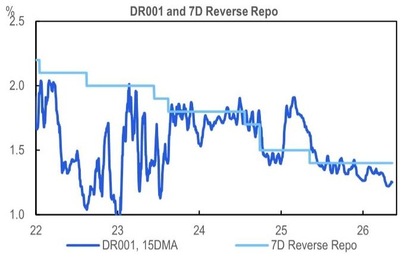
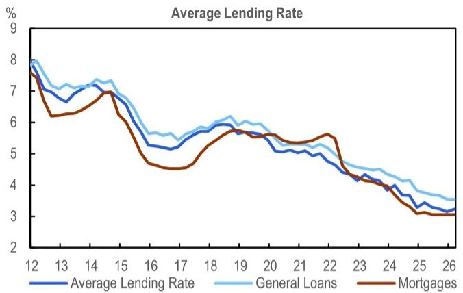

# The PBoC Is Not Easing: Why the Real Story in 1Q26 Is About Policy Transmission, Not Rate Cuts

China's central bank has made its position unmistakably clear: the next move in monetary policy will not be a rate cut. It will be a test of whether the existing easing can actually reach the real economy. The People's Bank of China's Monetary Policy Report for the first quarter of 2026, published on May 11, confirms that the policy debate has shifted from "how much more to ease" to "why has the easing not worked yet." This is a subtle but critical pivot that investors should not overlook.

The report arrives after an uneventful Politburo meeting and against a backdrop of modest price recovery, with the Producer Price Index turning positive in March for the first time in recent quarters. Yet the central bank's language reveals a deeper concern: imported inflation from commodity prices, a cautious eye on exchange rate stability, and a renewed emphasis on enforcement of interest rate compliance. These are not the signals of a central bank preparing to cut rates. They are the signals of a central bank trying to make its existing tools effective.

For investors, the implications are significant. The near-term outlook for Chinese bonds, the renminbi, and equity sectors tied to domestic demand will be shaped less by the timing of a symbolic rate cut and more by the success or failure of policy transmission. The question is not whether the PBoC will ease further, but whether the financial system will allow the easing that has already occurred to flow through.

## The Central Bank Has Stopped Guiding Rates Lower and Is Now Policing the Plumbing

The most striking feature of the 1Q26 MPR is what it does not say. The PBoC reiterated its commitment to keeping financing costs low, but it explicitly stopped short of guiding them lower. This is identical to the language used in the 4Q25 report, and it confirms that the central bank sees the current policy rate as appropriate for now.

What has changed is the level of specificity about interbank rates. The PBoC now explicitly states its intention to lead the overnight rate around the policy rate, a significant departure from the broader references to short-term money market rates in prior reports. This is not a minor editorial adjustment. It signals that the central bank is dissatisfied with the current degree of control over short-term rates and is tightening its operational framework.

More importantly, the PBoC has signaled a more assertive supervisory posture. It commits to conducting enforcement inspections of financial institutions' adherence to interest rate policies and on-site assessments of their pricing capabilities. The goal is to enhance financial institutions' interest rate pricing capabilities. This language is unusually direct for a central bank document that typically communicates through nuance.

The "so what" is straightforward: the PBoC believes that the barrier to lower effective lending rates is not the policy rate itself, but the unwillingness or inability of banks to transmit lower funding costs to borrowers. By policing pricing behavior, the central bank is attempting to force transmission through supervision rather than through further rate cuts. This approach carries its own risks, as it may compress bank margins further and create unintended consequences in credit allocation.

## The Return of "Stable Exchange Rate Environment" Language Points to Managed Appreciation

The 1Q26 MPR reintroduces a phrase that was conspicuously absent in the 4Q25 report: "create stable exchange rate environment for the real economy." This language previously appeared in the MPRs for 2Q25 and 3Q25, and its return is not coincidental.

In the context of a moderately loose monetary policy stance and a cautious outlook on imported inflation, the return of this phrase suggests that the PBoC is leaning toward a managed appreciation of the renminbi. This is a logical response to the current environment. If commodity prices are rising due to external factors, a stronger currency can help offset imported inflation. At the same time, the central bank is mindful of exporters' profit margins, which means any appreciation will be gradual and controlled.

The report also adds incremental but still vague detail on renminbi internationalization, introducing new language around optimizing cross-border fund management for foreign direct investment and overseas loans. This suggests the PBoC is seeking to broaden the renminbi's role as a funding currency, a natural next step in the internationalization agenda.

For investors, the implication is that the renminbi is likely to be supported in the near term, but the upcoming US-China Presidential Summit remains a potential catalyst that could move the exchange rate. The central bank is preparing for a range of outcomes, and the return of the "stable exchange rate environment" language is a signal that it is ready to act if needed.

## Artificial Intelligence Is Now a Macro Factor, But the Labor Market Risk Is Being Underestimated

For the first time, the PBoC discussed artificial intelligence in its sector analysis, and the numbers are striking. The core AI industry is estimated to have surpassed RMB 1.2 trillion in 2025, with meaningful contributions to exports and corporate profitability. The central bank cited 29% year-on-year revenue growth and 108% year-on-year profit growth in 2025 among AI-related companies listed on the STAR board.

The central bank's forward-looking commentary points to further technology breakthroughs, broader industrial adoption, and overseas expansion opportunities. This is consistent with the broader policy narrative of high-quality development and the transition from old economy drivers to new economy growth.

However, the report's treatment of AI's macro impact reveals a potential blind spot. The PBoC continues to characterize employment as stable, drawing on quarterly average unemployment rates. This overlooks a structural displacement risk that AI introduces in the labor market, particularly in services. Early warning signs may already be emerging: the unexpected rise in the unemployment rate in March, and the notable deterioration for the 25-29 age cohort, warrant closer scrutiny.

The disconnect is significant. If the new economy is now broadly comparable in scale to the old economy, as some estimates suggest, then the displacement effects of AI on employment could be larger than current policy discussions acknowledge. The PBoC's focus on growth and exports, rather than on labor market dynamics, may leave it underprepared for a scenario in which AI-driven productivity gains outpace job creation in affected sectors.

## What the Report Does Not Fully Answer: The Transmission Mechanism Remains a Black Box

For all its detail on policy stance, exchange rate management, and sector analysis, the 1Q26 MPR leaves a critical question unanswered: why has monetary policy transmission been so weak in the current cycle?

The report flags the central bank's intention to crack down on market practices deemed to obstruct monetary policy transmission, and it commits to enforcement inspections of financial institutions' pricing capabilities. But it does not provide a diagnosis of the underlying causes. Is the transmission problem driven by bank risk aversion? By weak credit demand from the real economy? By structural factors such as the dominance of state-owned enterprises in credit allocation? Or by something else entirely?

The answer matters for investors because it determines the likely effectiveness of the PBoC's current approach. If the problem is primarily on the supply side, then supervisory pressure on banks may improve transmission over time. But if the problem is on the demand side, then no amount of enforcement will create borrowers willing to take on debt in a weak economic environment.

This is the key analytical question that the report leaves open. The answer will determine whether the PBoC's current strategy of holding rates steady while policing transmission is sufficient, or whether more aggressive easing will eventually be necessary.

## A Decision Framework for Investors: How to Read the Next Signals

Given the current policy stance, investors should focus on three leading indicators that will determine the trajectory of Chinese monetary policy and its implications for markets.

First, watch the interbank rate. The PBoC's explicit guidance to lead the overnight rate around the policy rate means that any sustained deviation would be a signal of policy discomfort. If the overnight rate consistently trades above the policy rate, it would suggest that the central bank's control over short-term rates is weaker than desired, potentially forcing a policy response. Conversely, if it trades below, it would confirm that liquidity conditions remain very loose.

Second, monitor the lending rate data. The average lending rate has stayed close to its all-time low in 1Q26, but the dispersion across borrower types matters. If general loan rates continue to decline while mortgage rates remain sticky, it would suggest that transmission is happening unevenly, with households benefiting less than corporations. This would have implications for the property sector and consumer spending.

Third, track the unemployment rate for the 25-29 age cohort. This is the most sensitive indicator of AI-related labor market displacement. A sustained deterioration in this metric would likely trigger a policy response, potentially accelerating the timeline for a symbolic rate cut that the PBoC currently sees as contingent on fading export momentum or labor market stress.

The base case remains a symbolic 10 basis point cut in the second half of 2026, contingent on export momentum fading or labor market stress intensifying. Accelerating PPI inflation could further delay this cut. But the more important story is the one the PBoC is telling now: that the next phase of policy will be about making the existing easing work, not about adding more stimulus.

## Why This Analysis Matters for Your Investment Strategy

The 1Q26 MPR reveals a central bank that is acutely aware of the limits of its tools. It cannot force banks to lend if they do not want to. It cannot force companies to borrow if they do not see profitable opportunities. And it cannot fully insulate the domestic economy from external shocks, whether from commodity prices, trade tensions, or the global monetary policy response to the Middle East conflict.

What it can do is signal its intentions clearly, and the signal from this report is unmistakable: rates are on hold for now, the exchange rate will be managed with a bias toward stability and gradual appreciation, and the focus is on making the financial system work more efficiently.

For investors, this means that the near-term outlook for Chinese assets will be driven less by monetary policy surprises and more by the real economy's response to existing conditions. The success or failure of policy transmission will determine whether the current stance is sufficient or whether more aggressive action is eventually required.

Join the community to read the full report and review the original charts. The detailed data on interbank rates, lending rates, and sector-level employment trends are essential for building a complete picture of where Chinese monetary policy is heading and what it means for your portfolio.

*This article is for learning and discussion only and does not constitute investment advice.*
