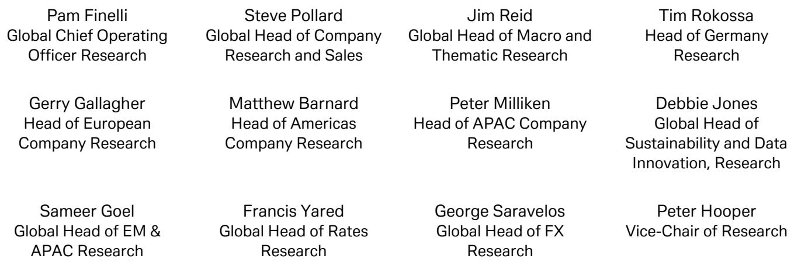

# China’s April Trade Surplus Reveals a Deeper Structural Shift That Markets Are Underpricing

The narrative that China’s export engine is sputtering has been decisively overturned by April’s data. Exports grew 14.1% year-on-year, handily beating both the consensus estimate of 8% and the more optimistic internal forecasts of 10%. This is not a one-month fluke driven by base effects or inventory restocking. It is the latest confirmation that a fundamental reconfiguration of China’s trade architecture is underway—one that is more resilient, more technologically intensive, and less dependent on Western consumer demand than at any point in the last decade.

What makes this cycle different is not the headline number alone, but the composition beneath it. The surge is being powered by what the original report terms “AHEAD” factors: AI-related products, autos and parts, and demand from emerging markets. The standout performer is the semiconductor and computer category, which saw export growth accelerate from an already impressive 50% in the first quarter to a staggering 73% in April. This is not a cyclical bounce; it is a structural re-rating of China’s position in the global technology supply chain.

Yet the real story—and the one that strategists should grapple with most seriously—lies on the import side. Imports surged 25.3% year-on-year, accelerating from the first quarter’s 23.6% and again beating expectations by a wide margin. For the first four months of the year, import growth has outpaced export growth by an average of 8 percentage points on a seasonally adjusted basis. This asymmetry is counterintuitive: a trade surplus is typically associated with export-led strength, but here the import data is telling us something more complex about the nature of China’s economic recovery and its industrial strategy.

The central question for investors is no longer whether China can export its way out of a domestic slowdown. The question is whether the import surge signals a genuine reflation of domestic demand, a strategic stockpiling of inputs for the next phase of industrial policy, or a combination of both. The answer will determine how to position across currencies, commodities, and emerging-market equities for the remainder of 2026.

## The Import Surge Is Not a Sign of Weakness; It Is a Leading Indicator of Export-Led Industrial Deepening

The most common interpretation of a rapid import acceleration is that domestic demand is overheating or that the economy is importing inflation. In China’s current context, that reading is incomplete. The data reveals that the largest drivers of import growth in the first quarter were AI-related products, primary products, metals, machinery, and chemicals. These are not consumer goods. They are the raw materials and capital equipment needed to produce the very exports that are currently surprising to the upside.

This is the critical insight: China is importing more not because its economy is faltering, but because it is building a more sophisticated export machine. The import data is a proxy for industrial deepening. When a country imports semiconductors, precision machinery, and advanced chemicals at an accelerating rate, it is investing in the capacity to produce higher-value-added goods for the global market. The 73% export growth in computers and semiconductors is not happening in a vacuum. It is being fueled by an equally aggressive build-out of upstream capacity.

The implication for investors is that China’s trade surplus, while still large, is becoming a less reliable indicator of the country’s economic health. A narrowing surplus driven by rising imports of productive inputs is fundamentally different from a narrowing surplus driven by falling exports. The former signals industrial upgrading; the latter signals competitive decline. Markets that treat the trade balance as a simple barometer of strength are missing the compositional shift.

## Rising Import Prices Are Creating a Hidden Tax on China’s Industrial Margins, but Also a Strategic Incentive to Stockpile

The report makes a second critical observation: for major imported goods with disclosed data, import-price growth in April broadly exceeded that of the first quarter. The most dramatic example is petroleum, where prices surged 42% year-on-year in April, a staggering 50-percentage-point acceleration from the first quarter. The contribution of price to total import value swung from a negative 13 percentage points in the first quarter to a positive 33 percentage points in April.

This is a double-edged sword. On one side, rising input costs compress margins for Chinese manufacturers, particularly those in energy-intensive industries. On the other side, the anticipation of further price increases is driving a wave of strategic stockpiling. The report notes that industrial inventories grew by 8.3% year-on-year in the first quarter, doubling the growth rate of the previous year. This is not accidental. Companies are building inventory buffers for three reasons: they expect commodity prices to keep rising; they anticipate stronger demand from the first year of the 15th Five-Year Plan; and they are positioning for the domestic AI build-out, which is already causing semiconductor and computer imports to exceed exports by a stunning USD 54 billion in the first four months.

The strategic takeaway is that China is using its current trade surplus to accumulate real assets and productive inputs at a time when global commodity prices are rising. This is a rational hedge. If commodity prices continue to climb, China’s stockpiling will prove prescient. If they reverse, the inventory overhang could become a drag. But the direction of policy is clear: the state and corporate sectors are prioritizing supply-chain security and input availability over short-term inventory cost optimization.

## The “AHEAD” Framework Is More Than a Mneumonic; It Is a New Map of Global Trade Flows That Investors Must Internalize

The report’s conceptual framework—grouping China’s export strength into AI-related products, autos and parts, HALO assets, and emerging-market demand—is not merely a convenient categorization. It represents a fundamental redrawing of the geography of global trade. The old model, in which China exported finished consumer goods to the United States and Europe and imported raw materials from the developing world, is being replaced by a more complex network.

In the new model, China exports advanced technology products to both developed and emerging markets, while simultaneously importing the intermediate goods needed to produce them. The 72% export growth in semiconductors and computers in April is not being driven by low-end assembly. It reflects a maturing ecosystem in which Chinese firms are moving up the value chain, producing chips, servers, and networking equipment that compete with established players in Taiwan, South Korea, and the United States.

At the same time, the HALO category—which includes machinery and metals—grew 6% in April, down from 12% in the first quarter. This deceleration may reflect base effects or temporary supply constraints, but it also raises a question that the report does not fully answer: can the HALO category sustain its momentum as global infrastructure spending cycles mature? The answer will depend on whether emerging-market demand remains robust, which in turn hinges on commodity prices, interest rates in the developing world, and China’s own Belt and Road financing.

What the report makes clear is that the AHEAD framework is not static. Each component has its own drivers and risks, and investors must track them individually rather than relying on a single export aggregate.

## What the Report Does Not Fully Answer: The Sustainability of the Import-Led Industrial Cycle and the Risk of Policy Overreach

For all its analytical rigor, the report leaves several meaningful questions open. The most pressing is whether the current import surge is sustainable without triggering a feedback loop of inflation and policy tightening. If Chinese companies are stockpiling inputs in anticipation of higher prices, and if those higher prices materialize, the resulting cost pressure could force the People’s Bank of China into a difficult choice between supporting growth and containing inflation.

A second unresolved question concerns the role of the 15th Five-Year Plan. The report speculates that investment in the first year of the plan could drive a significant recovery in industrial demand. But the plan’s details remain opaque. Will the investment be directed toward traditional infrastructure, which has diminishing returns, or toward new economy sectors like AI, quantum computing, and green energy? The answer will determine whether the import surge is a one-time stockpiling event or the beginning of a multiyear investment cycle.

Finally, the report does not address the geopolitical dimension directly. The 73% growth in semiconductor exports comes at a time when export controls and technology sanctions are tightening. How much of this growth is driven by genuine demand, and how much is a preemptive rush to ship products before further restrictions take effect? The data cannot answer this question, but investors must weigh it when assessing the durability of the trend.

## A Decision Framework for Investors: How to Interpret China’s Trade Data Through a Portfolio Lens

Given the complexity of the signals in the April data, investors need a structured framework for translating trade trends into portfolio decisions. The following three-step approach is designed to cut through the noise.

First, distinguish between price-driven and volume-driven import growth. If import value is rising primarily because of price increases, the implication is that China is a price taker in global commodity markets, and domestic margins will be squeezed. If import value is rising because of volume growth in productive inputs, the implication is that China is investing in future export capacity, which is a positive signal for technology and industrial stocks.

Second, track the divergence between the AHEAD categories. If semiconductor and computer exports continue to accelerate while autos and HALO exports decelerate, the market is signaling a shift toward technology leadership and away from traditional manufacturing. This has direct implications for sector allocation: overweight Chinese tech hardware and underweight traditional industrial exporters.

Third, monitor inventory-to-sales ratios in the industrial sector. The 8.3% inventory growth in the first quarter is manageable if sales continue to grow. If export growth slows in the second half of the year, however, the inventory build could become a drag on corporate profits and a catalyst for destocking. The key leading indicator is new export orders in the PMI survey.

This framework does not provide a single answer, but it gives investors a systematic way to update their views as new data arrives. The April trade report is a data point, not a verdict. The strategic question is how the trends evolve over the next two quarters.

## Why This Analysis Matters Now: The Window for Repositioning Is Open but Not Permanent

The April trade data has been released, but its implications have not yet been fully priced into markets. The consensus remains skeptical of China’s growth story, focused on the property sector and domestic consumption weakness. The trade data tells a different story—one of industrial dynamism, strategic stockpiling, and a quiet but powerful reconfiguration of global supply chains.

Investors who dismiss the import surge as a statistical artifact or a temporary blunder risk missing the most important structural shift in China’s economy since its accession to the World Trade Organization. The country is not just exporting more; it is exporting better. And it is importing the tools to do so.

The full report contains the original charts and detailed breakdowns that underpin this analysis, including the sector-level export growth figures, the inventory cycle data, and the import price decomposition. These charts are essential for any investor who wants to move beyond headlines and build a data-driven view of China’s trade trajectory.

Join the community to read the full report and review the original charts.

*This article is for learning and discussion only and does not constitute investment advice.*
